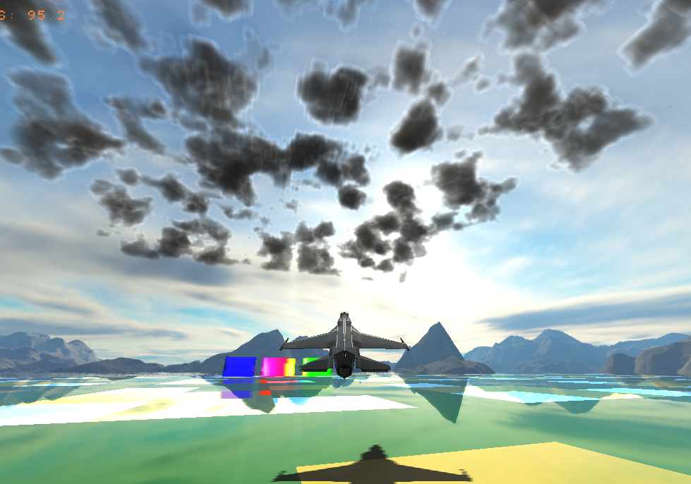
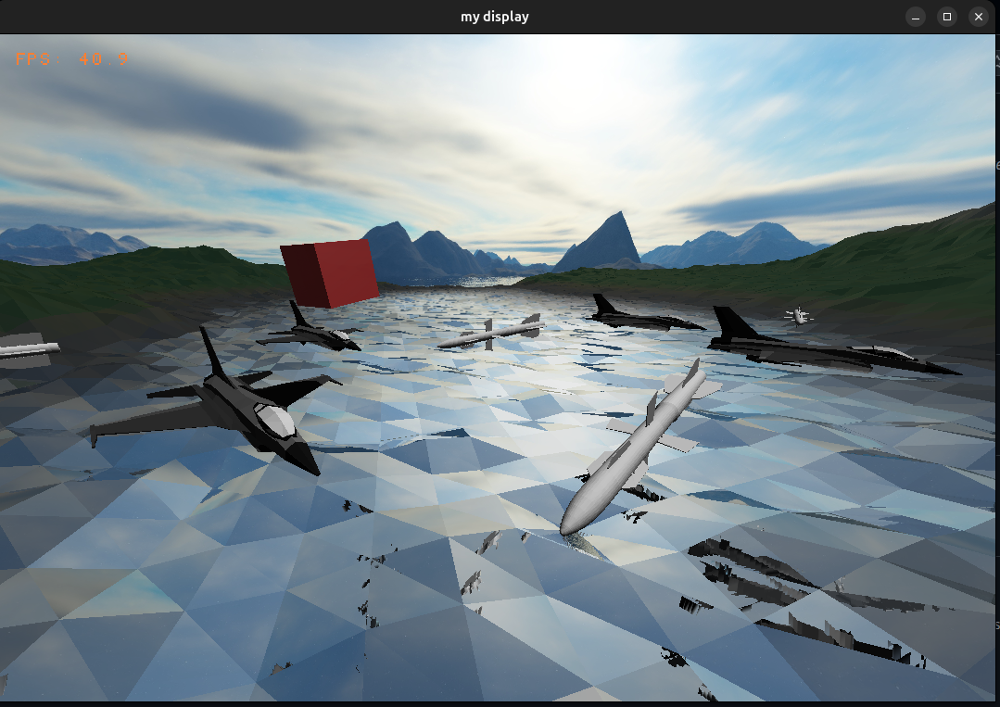

## TODO
- [X] sync all object
    - [X] why movement si so jerky (jumping around)
- [X] Server Synchronization
    - [X] crete simple project that will test diffrent methods
        - [X] TCP server
        - [X] we can simplify it we crete n planes on each client for while there are not used they are invisible and when user connect one of the planes will be given to user synchronization will work like this
        ```
        on innit => get free plane
        on update => send users plane state and receive new state we can add velocity to each plane so the state will be interpolated between updates
        on close => set planes as free and invisible
    - [ ] integrate it to main.c

- [ ] textures as post proces step on gpu we need to add uv mapping we shoulde use per triangle texture (normal, albedo ...)
    - [ ] input
        - [ ] 2d screen buffers (G-buffer)
            - [ ] Albedo map (HDR above 1 = lit)          <- rendered scene color
            - [ ] World space normal map
            - [ ] UV map
            - [ ] Texture ID map
            - [ ] Depth map

        - [ ] light
            - [ ] sun direction
            - [ ] light intensity

        - [ ] texture atlas
            - [ ] Blend Factor
            - [ ] Albedo              <- source texture (blend wit base color)
            - [ ] Normal map
            - [ ] Roughness
            - [ ] Metallic

- [ ] model editor / object editor / texture editor
- [X] 1. create generic server (async) client (async) and then use lib that is client and server side for model loading updating etc ...
    - [X] reqest designe
    ```c
    #typedef struct {
        uint32 Size
        int Id
        type Type // POST => no repliy, GET => repley
        uint8 data
    } Reqest;
    ```
    - expose function pointers on accept so we can implement own hadling for client and server for each type of reqest


        ```
- [X] God Rays
- [X] Emission
    - [X] crete emission map for each object
    
- [X] Shadows same as reflection
- [X] Clouds
- [X] Bloom
    - [X] Too slow
- [X] Replace screen space refection by raytraced onece
    - [X] use lower resolution and blur row apply it to frame buffer
        - [X] apply direct reflection [red][green][blue][roughness]
            - [X] we blur based on 4th channel
- [ ] GPU rendering (keep it simple — port current CPU pipeline (**later**)
    - [X] clouds
    - [X] god rays
- [ ] Plane controls
  - [ ] Use something like this but we will simplified it
    - [ ] Example

      ```c
      struct Plane {
          // Core simulation
          float position[3];                    // World coordinates (x, y, z) in meters
          float velocity[3];                    // Velocity vector (m/s)
          float acceleration[3];                // Current acceleration vector (m/s²)

          // Orientation & rotation
          float bodyOrientation[3];             // Aircraft's forward direction (unit vector)
          float upVector[3];                    // Aircraft's up direction (unit vector)
          float rightVector[3];                 // Aircraft's right direction (unit vector)
          float angularVelocity[3];             // Roll, pitch, yaw rates (rad/s)
          float eulerAngles[3];                 // Roll, pitch, yaw angles (radians)

          // Aerodynamic state
          float angleOfAttack;                  // Angle between body and velocity vector (radians)
          float sideslipAngle;                  // Side-slip angle for crosswind effects (radians)
          float bankAngle;                      // Roll angle from level flight (radians)

          // Mass properties
          float emptyMass;                      // Aircraft empty weight without fuel/payload (kg)
          float fuelMass;                       // Remaining fuel mass (kg)
          float payloadMass;                    // Weapons, sensors, cargo mass (kg)
          float totalMass;                      // Current total mass (empty + fuel + payload) (kg)
          float momentOfInertia[3];             // Resistance to rotation [roll, pitch, yaw] (kg·m²)
          float centerOfGravity[3];             // CG position relative to reference point (meters)

          // Propulsion
          float thrust;                         // Current thrust output (Newtons)
          float maxThrust;                      // Maximum available thrust at current altitude (N)
          float militaryThrust;                 // Non-afterburner thrust limit (N)
          float afterburnerThrust;              // Maximum thrust with afterburner (N)
          float throttle;                       // Throttle position (0-1, >1 for afterburner)
          bool afterburnerActive;               // Afterburner engagement state
          float fuelConsumption;                // Current fuel burn rate (kg/s)
          float fuelCapacity;                   // Maximum fuel capacity (kg)
          float specificFuelConsumption;        // Fuel efficiency (kg/N/s)
          float afterburnerSFC;                 // Fuel consumption with afterburner (kg/N/s)
          float engineTemp;                     // Engine exhaust temperature (Kelvin)
          float engineSignature;                // IR signature intensity for detection

          // Aerodynamic coefficients
          float zeroLiftDrag;                   // Base drag coefficient at zero lift (Cd0)
          float liftSlope;                      // Lift curve slope (per radian)
          float maxLiftCoeff;                   // Maximum achievable lift coefficient (Cl_max)
          float stallAoA;                       // Angle of attack where stall occurs (radians)
          float dragSlope;                      // Induced drag factor
          float crossSectionArea;               // Frontal area for drag calculations (m²)
          float wingArea;                       // Wing reference area for lift (m²)
          float wingspan;                       // Wing span (meters)
          float aspectRatio;                    // Wing aspect ratio (span²/area)
          float oswaldEfficiency;               // Wing efficiency factor (0.7-0.95)

          // Control surfaces
          float aileronDeflection[2];           // Left/Right aileron angles (radians)
          float elevatorDeflection[2];          // Left/Right elevator angles (radians)
          float rudderDeflection;               // Rudder angle (radians)
          float flapDeflection;                 // Flap extension angle (radians)
          float leadingEdgeFlaps;               // Leading edge flap angle (radians)
          float airbrakeDeflection;             // Speed brake extension (0-1)

          float aileronMaxDeflection;           // Maximum aileron angle (radians)
          float elevatorMaxDeflection;          // Maximum elevator angle (radians)
          float rudderMaxDeflection;            // Maximum rudder angle (radians)
          float flapMaxDeflection;              // Maximum flap angle (radians)

          float controlSurfaceRate[PLANE_CONTROL_SURFACES];   // Actuator speeds (rad/s)
          float controlEffectiveness[PLANE_CONTROL_SURFACES]; // Control power multipliers (0-1)

          // Flight control system
          float rollRate;                       // Current roll rate (rad/s)
          float pitchRate;                      // Current pitch rate (rad/s)
          float yawRate;                        // Current yaw rate (rad/s)
          float maxRollRate;                    // Maximum roll rate capability (rad/s)
          float maxPitchRate;                   // Maximum pitch rate capability (rad/s)
          float maxYawRate;                     // Maximum yaw rate capability (rad/s)

          float rollDamping;                    // Natural roll damping coefficient
          float pitchDamping;                   // Natural pitch damping coefficient
          float yawDamping;                     // Natural yaw damping coefficient

          // Performance limits
          float maxGPull;                       // Maximum sustained g-force capability
          float instantGLimit;                  // Structural g-load limit before damage
          float currentGForce;                  // Current g-force being experienced
          float maxDynamicPressure;             // Structural limit for dynamic pressure (Pa)
          float maxAoA;                         // Maximum safe angle of attack (radians)
          float maxSpeed;                       // Maximum velocity limit (m/s)
          float cornerVelocity;                 // Speed for maximum turn rate (m/s)
          float stallSpeed;                     // Minimum flying speed (m/s)

          // Flight envelope
          float serviceCeiling;                 // Maximum operational altitude (meters)
          float maxMach;                        // Maximum Mach number
          float optimalCruiseSpeed;             // Most efficient cruise speed (m/s)
          float optimalCruiseAltitude;          // Most efficient cruise altitude (meters)

          // Autopilot & guidance
          bool autopilotEnabled;                // Autopilot master switch
          float targetAltitude;                 // Desired altitude (meters)
          float targetSpeed;                    // Desired airspeed (m/s)
          float targetHeading;                  // Desired heading (radians)
          float targetPosition[3];              // Waypoint coordinates (meters)

          float pidRollGains[3];                // PID gains for roll control [P, I, D]
          float pidPitchGains[3];               // PID gains for pitch control [P, I, D]
          float pidYawGains[3];                 // PID gains for yaw control [P, I, D]
          float pidAltitudeGains[3];            // PID gains for altitude hold [P, I, D]
          float pidSpeedGains[3];               // PID gains for speed control [P, I, D]

          // Sensors & avionics
          struct IRSearchAndTrack irst;         // Infrared Search and Track system
          struct Camera cockpitCamera;          // Pilot's view camera
          float radarRange;                     // Radar detection range (meters)
          float radarFOV;                       // Radar field of view (radians)
          bool radarActive;                     // Radar emission state

          // Weapons & countermeasures
          struct Missile *loadedMissiles[MAX_PLANE_MISSILES]; // Missile hardpoints
          int missileCount;                     // Number of loaded missiles
          bool missileLaunched[MAX_PLANE_MISSILES];           // Track which missiles have been fired

          float chaffCount;                     // Remaining chaff cartridges
          float flareCount;                     // Remaining flare cartridges
          float heatAspect[6];                  // Heat radiation from each face of the missile

          // Visual effects
          struct FireSOA *engineExhaust;        // Engine plume particles
          struct Triangles *planeModel;         // 3D model geometry

          // Cached values (updated each frame)
          float machNumber;                     // Current Mach number
          float dynamicPressure;                // Current dynamic pressure 0.5*rho*v^2 (Pa)
          float indicatedAirspeed;              // Airspeed indicator reading (m/s)
          float trueAirspeed;                   // Actual airspeed (m/s)
          float groundSpeed;                    // Speed over ground (m/s)
          float altitude;                       // Current altitude above sea level (meters)
          float verticalSpeed;                  // Rate of climb/descent (m/s)
          float turnRadius;                     // Current turn radius (meters)
          float turnRate;                       // Current turn rate (rad/s)
      };
      ```

    - [ ] Flight model should be physics-based only — derived values like turn rate should not be hardcoded constants
    - [ ] Control by providing a target nose vector (like War Thunder)
      - [ ] Add damping to controls to avoid oscillations

- [ ] Radar / heat seeker simulation for missiles
  - [ ] Simulate radar scanning by sampling object ID buffer over a small cone area and computing RCS on hits
    - [ ] Non-Doppler radar: average terrain clutter hits with target hits to simulate ground return noise
    - [ ] Doppler radar: filter out stationary objects (terrain), track only moving targets (missiles, planes); requires relative velocity per object

- [ ] Missile guidance and control

- [ ] Server integration for multiplayer

- [X] Add screen space reflection

  Example:

  ```cl
  float3 sampleScreenSpaceReflectionFiltered(
      __global const float *ScreenColors,
      __global const float *ScreenDistances,
      const float3 rayOrigin,
      const float3 rayDirection,
      const float3 camPos,
      const float3 camDir,
      const float fov,
      const int screenWidth,
      const int screenHeight,
      const float maxDistance,
      const int maxSteps,
      const float stepSize) {
      float3 fallbackColor = (float3)(0.0f, 0.0f, 0.0f);

      float3 forward = normalize(camDir);
      float3 camUp = (float3)(0.0f, 1.0f, 0.0f);
      float3 right = normalize(cross(forward, camUp));
      float3 up = cross(right, forward);

      float3 currentPos = rayOrigin;
      float distanceTraveled = 0.0f;

      currentPos += rayDirection * stepSize * 0.5f;

      for (int step = 0; step < maxSteps; step++) {
          currentPos += rayDirection * stepSize;
          distanceTraveled += stepSize;

          if (distanceTraveled > maxDistance) {
              break;
          }

          float3 relativePos = currentPos - camPos;
          float depth = dot(relativePos, forward);

          if (depth <= 0.01f || depth > maxDistance) {
              continue;
          }

          float fovScale = 1.0f / (depth * fov);
          float screenRight = dot(relativePos, right) * fovScale;
          float screenUpward = dot(relativePos, up) * fovScale;

          float halfWidth = screenWidth * 0.5f;
          float halfHeight = screenHeight * 0.5f;

          float screenX = screenRight * halfWidth + halfWidth;
          float screenY = -screenUpward * halfHeight + halfHeight;

          if (screenX < 1.0f || screenX >= (screenWidth - 1.0f) ||
              screenY < 1.0f || screenY >= (screenHeight - 1.0f)) {
              continue;
          }

          int pixelX = (int)screenX;
          int pixelY = (int)screenY;
          int pixelIndex = pixelY * screenWidth + pixelX;

          if (pixelIndex < 0 || pixelIndex >= screenWidth * screenHeight) {
              continue;
          }

          float sceneDepth = ScreenDistances[pixelIndex];

          float depthThreshold = stepSize * 1.5f + depth * 0.001f;
          float depthDifference = depth - sceneDepth;

          if (sceneDepth > 0.01f && depthDifference > 0.0f && depthDifference < depthThreshold) {
              float fx = screenX - pixelX;
              float fy = screenY - pixelY;

              int x0 = clamp(pixelX, 0, screenWidth - 1);
              int x1 = clamp(pixelX + 1, 0, screenWidth - 1);
              int y0 = clamp(pixelY, 0, screenHeight - 1);
              int y1 = clamp(pixelY + 1, 0, screenHeight - 1);

              int idx00 = (y0 * screenWidth + x0) * 3;
              int idx10 = (y0 * screenWidth + x1) * 3;
              int idx01 = (y1 * screenWidth + x0) * 3;
              int idx11 = (y1 * screenWidth + x1) * 3;

              if (idx00 >= 0 && idx11 < screenWidth * screenHeight * 3) {
                  float3 color00 = (float3)(ScreenColors[idx00], ScreenColors[idx00 + 1], ScreenColors[idx00 + 2]);
                  float3 color10 = (float3)(ScreenColors[idx10], ScreenColors[idx10 + 1], ScreenColors[idx10 + 2]);
                  float3 color01 = (float3)(ScreenColors[idx01], ScreenColors[idx01 + 1], ScreenColors[idx01 + 2]);
                  float3 color11 = (float3)(ScreenColors[idx11], ScreenColors[idx11 + 1], ScreenColors[idx11 + 2]);

                  float3 colorTop = mix(color00, color10, fx);
                  float3 colorBottom = mix(color01, color11, fx);
                  float3 finalColor = mix(colorTop, colorBottom, fy);

                  if (length(finalColor) > 0.01f) {
                      return finalColor;
                  }
              }
          }
      }

      return fallbackColor;
  }
  ```

- [x] Test if using multiple rows per ray trace task improves performance (e.g. 8 rows per task)
  - Tested: it is better to use one task per row when there is a lot of work (**more work == fewer rows per task**, **less work == more rows per task**)

  ```
  Scene loaded. Total triangles: 136292
  ========================================
  Single-threaded Ray Performance:
  Average Time: 0.026903 seconds
  Median Time:  0.027284 seconds
  Min Time:     0.025808 seconds
  Max Time:     0.027431 seconds
  Variance:     0.000000
  99th Pct:     0.027431 seconds
  ========================================
  Multi-threaded (1 rows/task, 600 tasks):
  Average Time: 0.005078 seconds
  Median Time:  0.004794 seconds
  Min Time:     0.004677 seconds
  Max Time:     0.007933 seconds
  Variance:     0.000001
  99th Pct:     0.007933 seconds
  ========================================
  Multi-threaded (2 rows/task, 300 tasks):
  Average Time: 0.005364 seconds
  Median Time:  0.005025 seconds
  Min Time:     0.004868 seconds
  Max Time:     0.009057 seconds
  Variance:     0.000001
  99th Pct:     0.009057 seconds
  ========================================
  Multi-threaded (4 rows/task, 150 tasks):
  Average Time: 0.005452 seconds
  Median Time:  0.005324 seconds
  Min Time:     0.004900 seconds
  Max Time:     0.008086 seconds
  Variance:     0.000000
  99th Pct:     0.008086 seconds
  ========================================
  Multi-threaded (16 rows/task, 38 tasks):
  Average Time: 0.006851 seconds
  Median Time:  0.006668 seconds
  Min Time:     0.006153 seconds
  Max Time:     0.009899 seconds
  Variance:     0.000001
  99th Pct:     0.009899 seconds
  ========================================
  Multi-threaded (32 rows/task, 19 tasks):
  Average Time: 0.007200 seconds
  Median Time:  0.007292 seconds
  Min Time:     0.006357 seconds
  Max Time:     0.008172 seconds
  Variance:     0.000000
  99th Pct:     0.008172 seconds
  ========================================
  Multi-threaded (64 rows/task, 10 tasks):
  Average Time: 0.010450 seconds
  Median Time:  0.010735 seconds
  Min Time:     0.008400 seconds
  Max Time:     0.012504 seconds
  Variance:     0.000002
  99th Pct:     0.012504 seconds
  ========================================
  ========================================
  Multi-threaded (1 rows/task, 600 tasks):
  Average Time: 0.005038 seconds
  Median Time:  0.004943 seconds
  Min Time:     0.004715 seconds
  Max Time:     0.006126 seconds
  Variance:     0.000000
  99th Pct:     0.006126 seconds
  Correctness check passed.
  ```

## Current Render



## Airofoil and flaps simulation 
- [ ] integrated to exiting codebase and theirs standards
```c
// =============================================================================
//  aero_sim.h  –  Self-contained aerodynamics library for flight simulation
//
//  Supports: aircraft wings, control surfaces (flaps/ailerons/elevators/rudder),
//            missiles/rockets, fuselage body lift/drag, engine thrust,
//            atmosphere model, ground effect, compressibility, full 6DOF outputs.
//
//  Usage:
//    1. #include "aero_sim.h"
//    2. Build an AircraftConfig (or MissileConfig) once at init.
//    3. Each physics tick: fill in AircraftState, call calculateAircraftForces().
//    4. Feed result.force and result.moment into your 6DOF solver.
//
//  All units SI: metres, kg, seconds, Newtons, radians.
//  World space is caller-defined – pass consistent axis vectors in configs.
// =============================================================================

#pragma once
#include <math.h>
#include <string.h>

// =============================================================================
//  MATH PRIMITIVES
// =============================================================================

typedef struct { float x, y, z; }    float3;
typedef struct { float x, y, z, w; } float4;  // quaternion: w + xi + yj + zk

// --- float3 ops ---
static inline float3 f3(float x,float y,float z){ return (float3){x,y,z}; }
static inline float3 f3_add  (float3 a,float3 b){ return (float3){a.x+b.x,a.y+b.y,a.z+b.z}; }
static inline float3 f3_sub  (float3 a,float3 b){ return (float3){a.x-b.x,a.y-b.y,a.z-b.z}; }
static inline float3 f3_scale(float3 a,float  s){ return (float3){a.x*s,  a.y*s,  a.z*s  }; }
static inline float3 f3_neg  (float3 a)          { return (float3){-a.x,  -a.y,  -a.z   }; }
static inline float  f3_dot  (float3 a,float3 b){ return a.x*b.x+a.y*b.y+a.z*b.z; }
static inline float3 f3_cross(float3 a,float3 b){
    return (float3){ a.y*b.z-a.z*b.y, a.z*b.x-a.x*b.z, a.x*b.y-a.y*b.x };
}
static inline float  f3_len  (float3 a)          { return sqrtf(f3_dot(a,a)); }
static inline float  f3_len2 (float3 a)          { return f3_dot(a,a); }
static inline float3 f3_norm (float3 a){
    float l=f3_len(a); return l>1e-8f ? f3_scale(a,1.0f/l) : (float3){0,0,0};
}
static inline float3 f3_lerp(float3 a,float3 b,float t){
    return f3_add(f3_scale(a,1.0f-t),f3_scale(b,t));
}
static inline float3 f3_reflect(float3 v, float3 n){
    return f3_sub(v, f3_scale(n, 2.0f*f3_dot(v,n)));
}
static inline float3 f3_project_onto(float3 v, float3 onto){
    float3 n = f3_norm(onto);
    return f3_scale(n, f3_dot(v,n));
}
static inline float3 f3_reject_from(float3 v, float3 onto){
    return f3_sub(v, f3_project_onto(v,onto));
}

// --- scalar helpers ---
static inline float clampf(float v,float lo,float hi){ return v<lo?lo:(v>hi?hi:v); }
static inline float lerpf (float a,float b,float t)  { return a+(b-a)*t; }
static inline float smoothstep(float e0,float e1,float x){
    float t=clampf((x-e0)/(e1-e0),0.0f,1.0f);
    return t*t*(3.0f-2.0f*t);
}
static inline float signf(float x){ return x>=0.0f?1.0f:-1.0f; }

// --- quaternion helpers ---
static inline float4 quat_identity(void){ return (float4){0,0,0,1}; }
static inline float3 quat_rotate(float4 q, float3 v){
    // v' = q * (0,v) * q^-1
    float3 u  = {q.x,q.y,q.z};
    float  s  = q.w;
    float3 t  = f3_scale(f3_cross(u,v),2.0f);
    return f3_add(f3_add(v, f3_scale(t,s)), f3_cross(u,t));
}
static inline float4 quat_mul(float4 a, float4 b){
    return (float4){
        a.w*b.x+a.x*b.w+a.y*b.z-a.z*b.y,
        a.w*b.y-a.x*b.z+a.y*b.w+a.z*b.x,
        a.w*b.z+a.x*b.y-a.y*b.x+a.z*b.w,
        a.w*b.w-a.x*b.x-a.y*b.y-a.z*b.z
    };
}

// =============================================================================
//  ATMOSPHERE  –  ISA (International Standard Atmosphere) up to 86 km
// =============================================================================

typedef struct {
    float altitude;     // metres above sea level
    float temperature;  // K
    float pressure;     // Pa
    float density;      // kg/m³
    float speedOfSound; // m/s
    float dynamicVisc;  // Pa·s (for Reynolds number)
    float kinematicVisc;// m²/s
} AtmosphereState;

// Compute full ISA atmosphere at given altitude (m)
static inline AtmosphereState atmosphereISA(float altitudeM)
{
    const float T0  = 288.15f;   // sea-level temperature (K)
    const float P0  = 101325.0f; // sea-level pressure (Pa)
    const float L0  = -0.0065f;  // lapse rate troposphere (K/m)
    const float g   = 9.80665f;
    const float R   = 287.058f;  // specific gas const air
    const float gam = 1.4f;      // ratio of specific heats
    const float mu0 = 1.716e-5f; // reference dynamic viscosity
    const float T_ref=273.15f;   // Sutherland reference temp
    const float S    = 110.4f;   // Sutherland constant

    AtmosphereState atm;
    atm.altitude = altitudeM;
    float h = clampf(altitudeM, -500.0f, 86000.0f);

    float T, P;
    if (h <= 11000.0f) {
        // Troposphere
        T = T0 + L0 * h;
        P = P0 * powf(T / T0, -g / (L0 * R));
    } else if (h <= 20000.0f) {
        // Lower stratosphere (isothermal)
        float T11 = T0 + L0 * 11000.0f;
        float P11 = P0 * powf(T11 / T0, -g / (L0 * R));
        T = T11;
        P = P11 * expf(-g * (h - 11000.0f) / (R * T11));
    } else {
        // Upper stratosphere (+2 K/km lapse)
        float L2 = 0.001f;
        float T11 = T0 + L0 * 11000.0f;
        float P11 = P0 * powf(T11 / T0, -g / (L0 * R));
        float T20 = T11;
        float P20 = P11 * expf(-g * 9000.0f / (R * T11));
        T = T20 + L2 * (h - 20000.0f);
        P = P20 * powf(T / T20, -g / (L2 * R));
    }

    atm.temperature   = T;
    atm.pressure      = P;
    atm.density       = P / (R * T);
    atm.speedOfSound  = sqrtf(gam * R * T);
    // Sutherland's law for dynamic viscosity
    atm.dynamicVisc   = mu0 * powf(T / T_ref, 1.5f) * (T_ref + S) / (T + S);
    atm.kinematicVisc = atm.dynamicVisc / atm.density;

    return atm;
}

// Quick density lookup (use when you don't need full state)
static inline float atmosphereDensity(float altM){
    return atmosphereISA(altM).density;
}

// =============================================================================
//  COMPRESSIBILITY  –  Prandtl-Glauert + transonic corrections
// =============================================================================

typedef struct {
    float mach;              // flight Mach number
    float pgFactor;          // Prandtl-Glauert: 1/sqrt(1-M²) for subsonic
    float cdWave;            // wave drag coefficient addition (transonic/supersonic)
    float clCompressibility; // Cl multiplier
} CompressibilityState;

static inline CompressibilityState compressibilityCalc(float speed, float speedOfSound)
{
    CompressibilityState c;
    c.mach = speed / (speedOfSound + 1e-6f);
    float M = c.mach;

    if (M < 0.7f) {
        // Subsonic: Prandtl-Glauert
        float beta = sqrtf(fmaxf(1.0f - M*M, 0.01f));
        c.pgFactor          = 1.0f / beta;
        c.cdWave            = 0.0f;
        c.clCompressibility = c.pgFactor;
    } else if (M < 1.05f) {
        // Transonic: blend to supersonic, add wave drag
        float t = (M - 0.7f) / 0.35f; // 0 at M=0.7, 1 at M=1.05
        c.pgFactor          = lerpf(1.0f/sqrtf(0.51f), 1.0f, t);
        // Wave drag: peaks around M=1, falls off above
        float wave_peak     = 4.0f * t * (1.0f - t); // parabola 0→1→0
        c.cdWave            = 0.05f + 0.15f * wave_peak;
        c.clCompressibility = lerpf(1.0f/sqrtf(0.51f), 1.2f, t);
    } else {
        // Supersonic: Ackeret theory — Cl slope drops
        float beta = sqrtf(fmaxf(M*M - 1.0f, 0.01f));
        c.pgFactor          = 1.0f;
        c.cdWave            = 0.04f + 0.02f / beta; // wave drag reduces with M
        c.clCompressibility = 4.0f / (beta + 1e-4f) / (2.0f * 3.14159f); // normalised
    }
    return c;
}

// =============================================================================
//  AEROFOIL PROFILE  –  cross-section aerodynamic character
// =============================================================================

typedef struct {
    float clAlpha;          // lift-curve slope (rad⁻¹), ~2π thin aerofoil
    float cl0;              // Cl at zero AoA (camber contribution)
    float alphaZeroLift;    // AoA where Cl=0 (rad)
    float alphaStallPos;    // positive stall onset (rad)
    float alphaStallNeg;    // negative stall onset (rad)
    float clMax;            // max Cl at stall
    float clMin;            // min Cl at negative stall
    float cd0;              // minimum profile drag
    float cd2;              // induced drag polar factor
    float cm0;              // pitching moment at zero lift
    float stallSoftness;    // blend width (rad) — larger = more gradual
    float thicknessRatio;   // t/c — affects transonic drag rise
} AerofoilProfile;

static inline AerofoilProfile aerofoilNACA2412(void){
    return (AerofoilProfile){6.28f,0.25f,-0.036f, 0.279f,-0.314f,
        1.5f,-1.1f, 0.0060f,0.0042f,-0.047f,0.08f,0.12f};
}
static inline AerofoilProfile aerofoilSymmetric(void){
    return (AerofoilProfile){5.73f,0.0f, 0.0f,   0.262f,-0.262f,
        1.2f,-1.2f, 0.0055f,0.0038f, 0.000f,0.07f,0.09f};
}
static inline AerofoilProfile aerofoilHighLift(void){
    return (AerofoilProfile){6.8f, 0.6f,-0.087f, 0.227f,-0.349f,
        2.4f,-0.8f, 0.0110f,0.0055f,-0.120f,0.12f,0.14f};
}
static inline AerofoilProfile aerofoilSupersonic(void){
    // Double-wedge / biconvex for supersonic surfaces
    return (AerofoilProfile){4.0f, 0.0f, 0.0f,   0.349f,-0.349f,
        1.0f,-1.0f, 0.0080f,0.0060f, 0.000f,0.10f,0.04f};
}

// Internal: compute Cl/Cd/Cm at given alpha, with stall model
static void aerofoilCoeffs(const AerofoilProfile *p, float alpha,
                            float machCorrection,
                            float *out_Cl, float *out_Cd, float *out_Cm)
{
    // Linear Cl
    float Cl_lin = (p->cl0 + p->clAlpha * (alpha - p->alphaZeroLift)) * machCorrection;

    // Stall blending
    float t_pos = smoothstep(p->alphaStallPos,
                              p->alphaStallPos + p->stallSoftness, alpha);
    float t_neg = smoothstep(p->alphaStallNeg,
                              p->alphaStallNeg - p->stallSoftness, alpha);
    // Post-stall flat-plate contribution
    float Cl_fp = 2.0f * sinf(alpha) * cosf(alpha);

    float Cl = Cl_lin * (1.0f-t_pos) * (1.0f-t_neg)
             + lerpf(Cl_lin, p->clMax,  t_pos) * t_pos * (1.0f-t_neg)
             + lerpf(Cl_lin, p->clMin,  t_neg) * t_neg * (1.0f-t_pos);
    // Full stall: converge toward flat plate
    float stall_full = fmaxf(t_pos, t_neg);
    Cl = lerpf(Cl, Cl_fp, stall_full * 0.6f);
    Cl = clampf(Cl, p->clMin - 0.05f, p->clMax + 0.05f);

    // Drag polar + separation drag
    float Cd = p->cd0 + p->cd2 * Cl * Cl
             + stall_full * 0.15f * sinf(alpha) * sinf(alpha);

    *out_Cl = Cl;
    *out_Cd = Cd;
    *out_Cm = p->cm0;
}

// =============================================================================
//  FLAP / CONTROL SURFACE
// =============================================================================

typedef struct {
    float3 neutralNormal;       // surface normal at 0 deflection (unit)
    float3 hingeAxis;           // rotation axis (unit)
    float  area;                // planform area (m²)
    float  maxDeflectionRad;    // travel limit (rad)
    float  aspectRatio;
    float  oswaldEfficiency;
    float  cd0;
    float  cdDeflectionScale;
    float  stallAngleRad;
    float  stallSoftness;
    float  flatPlateBlend;
    float  effectiveness;       // 0-1 scalar: degraded by damage, ice, etc.
} FlapConfig;

typedef struct {
    float  angle;               // normalised command [-1,1], 0=neutral
    float  angleRate;           // d(angle)/dt (for unsteady correction)
    float3 velocity;            // local velocity through air (m/s)
    // Outputs
    float3 lastForce;
    float  lastCl, lastCd, lastAlphaRad;
} FlapState;

static inline FlapConfig flapConfigDefaults(void){
    return (FlapConfig){
        {0,1,0},{1,0,0}, 0.5f,0.698f,4.5f,0.82f,
        0.012f,0.08f,1.05f,0.15f,0.5f,1.0f
    };
}
static inline FlapState flapStateDefaults(void){
    FlapState s; memset(&s,0,sizeof(s)); return s;
}

float3 calculateFlapForce(const FlapConfig *cfg, FlapState *state)
{
    const float PI = 3.14159265f;
    float eff  = clampf(cfg->effectiveness, 0.0f, 1.0f);
    float defl = state->angle * cfg->maxDeflectionRad;
    float cd   = cosf(defl), sd = sinf(defl);
    float3 ax  = cfg->hingeAxis, n0 = cfg->neutralNormal;
    float3 n_flap = f3_norm(f3_add(
        f3_add(f3_scale(n0,cd), f3_scale(f3_cross(ax,n0),sd)),
        f3_scale(ax, f3_dot(n0,ax)*(1.0f-cd))));

    float speed = f3_len(state->velocity);
    if (speed < 0.1f){ state->lastForce=(float3){0,0,0}; return state->lastForce; }

    float3 v_dir = f3_norm(state->velocity);
    float  q     = 0.5f * 1.225f * speed * speed; // caller can pass density if needed

    float sin_a = clampf(f3_dot(f3_neg(v_dir),n_flap),-1.0f,1.0f);
    float alpha = asinf(sin_a);

    float cl_att = 2.0f*PI*sin_a*cosf(alpha);
    float cl_sep = 2.0f*sin_a*cosf(alpha);
    float st     = clampf((fabsf(alpha)-cfg->stallAngleRad)/cfg->stallSoftness,0,1);
    float Cl     = (cl_att*(1.0f-st)+cl_sep*st + state->angleRate*0.15f)*eff;
    float Cd     = cfg->cd0 + cfg->cdDeflectionScale*fabsf(sinf(defl))
                 + Cl*Cl/(PI*cfg->aspectRatio*cfg->oswaldEfficiency);

    float3 lift_dir = f3_norm(f3_sub(n_flap, f3_scale(v_dir, f3_dot(n_flap,v_dir))));
    float  S        = q * cfg->area;
    float3 fp_f     = f3_scale(n_flap, 2.0f*sin_a*sin_a*S*fabsf(sinf(defl))*cfg->flatPlateBlend*0.5f);

    state->lastForce    = f3_add(f3_add(f3_scale(lift_dir,Cl*S),f3_scale(v_dir,-Cd*S)),fp_f);
    state->lastCl       = Cl;
    state->lastCd       = Cd;
    state->lastAlphaRad = alpha;
    return state->lastForce;
}

// =============================================================================
//  WING
// =============================================================================

#define WING_MAX_FLAPS   4
#define WING_STRIPS      10     // spanwise integration strips

typedef enum { WING_SIDE_LEFT=-1, WING_SIDE_RIGHT=1, WING_SIDE_CENTER=0 } WingSide;

typedef struct {
    WingSide       side;
    float3         rootPosition;    // root attachment point (body space)
    float3         spanAxis;        // root→tip unit vector
    float3         chordAxis;       // leading→trailing unit vector
    float3         liftAxis;        // normal to chord plane (up for wing)

    float          span;            // half-span root→tip (m)
    float          rootChord;       // chord at root (m)
    float          tipChord;        // chord at tip (m)
    float          sweep;           // quarter-chord sweep (rad)
    float          dihedral;        // dihedral angle (rad)
    float          twist;           // total geometric washout root→tip (rad)
    float          incidence;       // fixed angle of incidence (rad)

    // Derived (call wingComputeDerived)
    float          area;
    float          aspectRatio;
    float          meanAeroChord;
    float          taperRatio;

    AerofoilProfile profile;
    float          oswaldEfficiency;
    float          groundEffectSpan; // full wingspan for IGE calc

    // Flaps
    int            flapCount;
    FlapConfig     flaps[WING_MAX_FLAPS];
    float          flapSpanStart[WING_MAX_FLAPS]; // normalised [0,1]
    float          flapSpanEnd  [WING_MAX_FLAPS];
} WingConfig;

typedef struct {
    float3     velocity;            // root velocity through air (world space, m/s)
    float3     angularVelocity;     // body angular velocity (rad/s)
    float      airDensity;          // kg/m³ (from atmosphere model)
    float      speedOfSound;        // m/s
    float      groundHeight;        // height AGL below wing root (m)

    FlapState  flapStates[WING_MAX_FLAPS];

    // Outputs
    float3     totalForce;
    float3     totalMoment;         // about rootPosition
    float      lastCl, lastCd;
    float      lastAlphaRad;
    float      lastLiftN, lastDragN;
    float      inducedDragFactor;
} WingState;

static inline void wingComputeDerived(WingConfig *c){
    c->taperRatio    = c->rootChord>1e-6f ? c->tipChord/c->rootChord : 0.0f;
    c->area          = 0.5f*(c->rootChord+c->tipChord)*c->span;
    c->aspectRatio   = c->area>1e-6f ? (c->span*c->span)/c->area : 1.0f;
    float tr=c->taperRatio;
    c->meanAeroChord = (2.0f/3.0f)*c->rootChord*(1.0f+tr+tr*tr)/(1.0f+tr+1e-6f);
}

static inline WingConfig wingConfigDefaults(WingSide side){
    WingConfig c; memset(&c,0,sizeof(c));
    c.side       = side;
    float s      = (side==WING_SIDE_LEFT) ? -1.0f : 1.0f;
    c.spanAxis   = f3(s,0,0);
    c.chordAxis  = f3(0,0,1);
    c.liftAxis   = f3(0,1,0);
    c.span=6.0f; c.rootChord=1.8f; c.tipChord=0.9f;
    c.dihedral=0.052f; c.twist=-0.035f; c.incidence=0.035f;
    c.profile         = aerofoilNACA2412();
    c.oswaldEfficiency= 0.82f;
    c.groundEffectSpan= 12.0f;
    wingComputeDerived(&c);
    return c;
}

static inline WingState wingStateDefaults(void){
    WingState s; memset(&s,0,sizeof(s));
    s.airDensity=1.225f; s.speedOfSound=340.0f; s.groundHeight=1e5f;
    for(int i=0;i<WING_MAX_FLAPS;i++) s.flapStates[i]=flapStateDefaults();
    return s;
}

// Ground effect: Wieselsburger model
static float groundEffectFactor(float h, float span){
    if(h<=0.0f) return 0.05f;
    float r=(16.0f*h)/span;
    return clampf(r*r/(1.0f+r*r),0.05f,1.0f);
}

float3 calculateWingForce(const WingConfig *cfg, WingState *state)
{
    const float PI=3.14159265f;
    float speed = f3_len(state->velocity);

    // Compressibility
    CompressibilityState comp = compressibilityCalc(speed, state->speedOfSound);
    float machCorr = clampf(comp.clCompressibility, 0.5f, 3.0f);

    float ige = groundEffectFactor(state->groundHeight, cfg->groundEffectSpan);
    float k   = ige / (PI * cfg->aspectRatio * cfg->oswaldEfficiency);
    state->inducedDragFactor = k;

    float3 totalForce  = {0,0,0};
    float3 totalMoment = {0,0,0};
    float  accLift=0, accDrag=0, accArea=0;

    for(int i=0;i<WING_STRIPS;i++){
        float t_lo  = (float)i      /WING_STRIPS;
        float t_hi  = (float)(i+1)  /WING_STRIPS;
        float t_mid = 0.5f*(t_lo+t_hi);

        float chord    = cfg->rootChord + (cfg->tipChord-cfg->rootChord)*t_mid;
        float dSpan    = cfg->span/WING_STRIPS;
        float stripArea= chord*dSpan;

        // Dihedral: liftAxis rotates along span
        float dih = cfg->dihedral * t_mid;
        float3 stripLift = f3_norm(f3_add(
            f3_scale(cfg->liftAxis, cosf(dih)),
            f3_scale(cfg->spanAxis, sinf(dih) * (cfg->side==WING_SIDE_LEFT?-1.0f:1.0f))
        ));

        // Strip position
        float3 stripPos = f3_add(cfg->rootPosition, f3_scale(cfg->spanAxis, t_mid*cfg->span));

        // Strip velocity (root + omega x r)
        float3 r_strip  = f3_sub(stripPos, cfg->rootPosition);
        float3 v_strip  = f3_add(state->velocity, f3_cross(state->angularVelocity, r_strip));
        float  v2       = f3_len2(v_strip);
        if(v2 < 0.01f) continue;

        float3 v_dir    = f3_norm(v_strip);
        float  q_strip  = 0.5f * state->airDensity * v2;

        // AoA: incidence + linear washout twist
        float twist_here = cfg->twist * t_mid;
        float incidence  = cfg->incidence + twist_here;

        float flow_up    = f3_dot(f3_neg(v_dir), stripLift);
        float flow_fwd   = f3_dot(f3_neg(v_dir), cfg->chordAxis);
        float alpha      = atan2f(flow_up, fabsf(flow_fwd)+1e-6f) + incidence;

        float Cl, Cd_prof, Cm;
        aerofoilCoeffs(&cfg->profile, alpha, machCorr, &Cl, &Cd_prof, &Cm);

        // Total drag: profile + induced (with ground effect) + wave drag
        float Cd = Cd_prof + k*Cl*Cl + comp.cdWave*cfg->profile.thicknessRatio;

        // Force directions
        float3 lift_dir = f3_norm(f3_reject_from(stripLift, v_dir));
        float3 drag_dir = f3_neg(v_dir);
        float  S        = q_strip * stripArea;

        float3 strip_f  = f3_add(f3_scale(lift_dir,Cl*S), f3_scale(drag_dir,Cd*S));

        // Moment arm to aerodynamic centre (25% chord aft of leading edge)
        float3 ac_pos   = f3_add(stripPos, f3_scale(cfg->chordAxis, 0.25f*chord));
        float3 arm      = f3_sub(ac_pos, cfg->rootPosition);
        float3 mom      = f3_add(f3_cross(arm,strip_f),
                                 f3_scale(stripLift, Cm*S*chord));

        totalForce  = f3_add(totalForce,  strip_f);
        totalMoment = f3_add(totalMoment, mom);
        accLift    += Cl*S;
        accDrag    += Cd*S;
        accArea    += stripArea;
    }

    // Flap contributions
    for(int fi=0;fi<cfg->flapCount;fi++){
        FlapState *fs   = &state->flapStates[fi];
        // Approx: flap velocity = wing root velocity
        fs->velocity    = state->velocity;
        float3 ff       = calculateFlapForce(&cfg->flaps[fi], fs);
        float  flapMidT = 0.5f*(cfg->flapSpanStart[fi]+cfg->flapSpanEnd[fi]);
        float3 flapPos  = f3_add(cfg->rootPosition, f3_scale(cfg->spanAxis, flapMidT*cfg->span));
        totalForce  = f3_add(totalForce, ff);
        totalMoment = f3_add(totalMoment, f3_cross(f3_sub(flapPos,cfg->rootPosition), ff));
    }

    // Write outputs
    state->totalForce  = totalForce;
    state->totalMoment = totalMoment;
    state->lastLiftN   = accLift;
    state->lastDragN   = accDrag;
    float refS = cfg->area;
    float refQ = 0.5f*state->airDensity*(speed*speed+1e-6f);
    state->lastCl = (refQ*refS>1e-6f) ? accLift/(refQ*refS) : 0.0f;
    state->lastCd = (refQ*refS>1e-6f) ? accDrag/(refQ*refS) : 0.0f;
    return totalForce;
}

// =============================================================================
//  ENGINE / THRUST
// =============================================================================

typedef enum {
    ENGINE_TYPE_JET,        // thrust lapse with altitude/speed
    ENGINE_TYPE_PROP,       // thrust reduces with airspeed, efficiency curve
    ENGINE_TYPE_ROCKET,     // constant thrust regardless of altitude/speed
    ENGINE_TYPE_RAMJET,     // only works above Mach ~0.5
} EngineType;

typedef struct {
    EngineType type;
    float3     thrustAxis;      // unit vector, body space (e.g. {0,0,-1} = forward)
    float3     mountPosition;   // body space — for torque from off-axis engines

    float  maxThrust;           // N at sea level static
    float  minThrust;           // N at idle (jets: ~5% max, rockets: 0)
    float  specificFuelConsump; // kg/(N·s) — for fuel burn simulation

    // Jet-specific
    float  altitudeLapseFactor; // thrust = maxThrust * (rho/rho0)^lapseFactor
    float  ramPressureGain;     // ram recovery at speed (0=none, 0.5=typical)

    // Prop-specific
    float  propDiameter;        // m
    float  propEfficiency;      // eta at design point (~0.82 typical)
    float  propRPM;             // design RPM

    // Afterburner
    int    hasAfterburner;
    float  afterburnerThrustMult; // typically 1.5–1.7

    // State
    float  throttle;            // 0–1 (input)
    int    afterburnerOn;       // 0 or 1
    float  currentThrust;       // N (output, after lapse)
    float  fuelFlowKgS;         // kg/s (output)
} EngineConfig;

static inline EngineConfig engineJetDefaults(void){
    EngineConfig e; memset(&e,0,sizeof(e));
    e.type                = ENGINE_TYPE_JET;
    e.thrustAxis          = f3(0,0,-1);  // forward
    e.maxThrust           = 80000.0f;    // 80 kN (typical fighter)
    e.minThrust           = 4000.0f;
    e.specificFuelConsump = 2.0e-5f;
    e.altitudeLapseFactor = 0.9f;
    e.ramPressureGain     = 0.3f;
    e.hasAfterburner      = 1;
    e.afterburnerThrustMult=1.6f;
    return e;
}

static inline EngineConfig engineRocketDefaults(void){
    EngineConfig e; memset(&e,0,sizeof(e));
    e.type      = ENGINE_TYPE_ROCKET;
    e.thrustAxis= f3(0,0,-1);
    e.maxThrust = 50000.0f;
    e.minThrust = 0.0f;
    e.specificFuelConsump = 3.5e-4f; // rockets are thirsty
    return e;
}

typedef struct {
    float3 force;       // thrust force (N, world space)
    float3 moment;      // torque from off-axis mount (N·m)
    float  fuelFlowKgS; // fuel consumption rate
} EngineForceResult;

static EngineForceResult calculateEngineForce(
    EngineConfig *eng,
    float3        bodyThrustAxisWorld, // thrustAxis rotated to world space
    float         speed,              // airspeed m/s
    float         airDensity,         // kg/m³
    float3        bodyOriginWorld)    // mount position in world space
{
    const float RHO0 = 1.225f;
    float throttle   = clampf(eng->throttle, 0.0f, 1.0f);

    float rawThrust = lerpf(eng->minThrust, eng->maxThrust, throttle);

    // Afterburner
    if(eng->hasAfterburner && eng->afterburnerOn)
        rawThrust *= eng->afterburnerThrustMult;

    float thrust = rawThrust;

    switch(eng->type){
        case ENGINE_TYPE_JET:{
            // Thrust lapse with altitude
            float densRatio = airDensity / RHO0;
            float altFactor = powf(densRatio, eng->altitudeLapseFactor);
            // Ram recovery (intake pressure rise at speed)
            float mach      = speed / 340.0f;
            float ramFactor = 1.0f + eng->ramPressureGain * mach * mach * 0.5f;
            thrust = rawThrust * altFactor * ramFactor;
            break;
        }
        case ENGINE_TYPE_PROP:{
            // Thrust drops as airspeed increases (momentum theory)
            // T = eta * P / v  (simplified)
            float vEff = fmaxf(speed, 5.0f); // avoid /0 at zero speed
            float T_static = rawThrust;
            float T_moving = eng->propEfficiency * rawThrust * 15.0f / vEff;
            float densRatio= airDensity/RHO0;
            thrust = fminf(T_static, T_moving) * densRatio;
            break;
        }
        case ENGINE_TYPE_ROCKET:
            // Constant thrust in vacuum/atmosphere alike
            thrust = rawThrust;
            break;
        case ENGINE_TYPE_RAMJET:{
            float mach = speed/340.0f;
            float ramEff = clampf((mach-0.5f)/1.5f, 0.0f, 1.0f); // spools up 0.5–2.0 Mach
            thrust = rawThrust * ramEff;
            break;
        }
    }

    eng->currentThrust  = thrust;
    eng->fuelFlowKgS    = thrust * eng->specificFuelConsump;

    EngineForceResult r;
    r.force         = f3_scale(bodyThrustAxisWorld, thrust);
    r.moment        = f3_cross(eng->mountPosition, f3_scale(eng->thrustAxis, thrust));
    r.fuelFlowKgS   = eng->fuelFlowKgS;
    return r;
}

// =============================================================================
//  FUSELAGE / BODY DRAG
//  Models the pressure + skin friction drag of the main body, plus body lift.
// =============================================================================

typedef struct {
    float  length;              // m
    float  maxDiameter;         // m
    float  baseArea;            // m² — base drag reference (≈ π r²)
    float  wettedArea;          // m² — skin friction reference
    float  cd_friction;         // skin friction drag coefficient (~0.003–0.005)
    float  cd_base;             // base drag coefficient (~0.1–0.15 for blunt)
    float  cd_nose;             // nose pressure drag (streamlined: ~0.01)
    float  bodyLiftFactor;      // body lift per radian AoA (Munk's slender body)
    float  finenessRatio;       // length/diameter — used for wave drag
    float3 centerOfPressure;    // body-space position of aero centre
} FuselageConfig;

static inline FuselageConfig fuselageConfigDefaults(void){
    FuselageConfig f;
    f.length=10.0f; f.maxDiameter=1.2f;
    f.baseArea   = 3.14159f*0.6f*0.6f;
    f.wettedArea = 3.14159f*1.2f*10.0f;
    f.cd_friction= 0.003f; f.cd_base=0.12f; f.cd_nose=0.02f;
    f.bodyLiftFactor = 0.8f;   // slender body theory coefficient
    f.finenessRatio  = 10.0f/1.2f;
    f.centerOfPressure = f3(0, 0, 0);
    return f;
}

typedef struct {
    float3 velocity;        // body velocity through air
    float  airDensity;
    float  speedOfSound;
    float3 bodyForwardAxis; // unit vector in world space
    float3 bodyUpAxis;      // unit vector in world space

    // Outputs
    float3 force;
    float3 moment;          // about center of pressure
    float  alphaRad;
    float  betaRad;         // sideslip
} FuselageState;

static inline FuselageState fuselageStateDefaults(void){
    FuselageState s; memset(&s,0,sizeof(s));
    s.airDensity=1.225f; s.speedOfSound=340.0f;
    s.bodyForwardAxis=f3(0,0,-1); s.bodyUpAxis=f3(0,1,0);
    return s;
}

void calculateFuselageForce(const FuselageConfig *cfg, FuselageState *state)
{
    float speed = f3_len(state->velocity);
    if(speed < 0.1f){ state->force=(float3){0,0,0}; return; }

    float3 v_dir = f3_norm(state->velocity);
    float  q     = 0.5f * state->airDensity * speed * speed;

    // AoA and sideslip
    float cos_a  = clampf(-f3_dot(v_dir, state->bodyForwardAxis),-1,1);
    float alpha  = acosf(cos_a);  // total incidence angle
    float a_up   = f3_dot(f3_neg(v_dir), state->bodyUpAxis);
    float a_side = f3_dot(f3_neg(v_dir),
                    f3_cross(state->bodyUpAxis, state->bodyForwardAxis));
    state->alphaRad = atan2f(a_up,    cos_a + 1e-6f);
    state->betaRad  = atan2f(a_side,  cos_a + 1e-6f);

    // Compressibility
    CompressibilityState comp = compressibilityCalc(speed, state->speedOfSound);

    // Axial drag
    float Cd_fric = cfg->cd_friction * cfg->wettedArea / cfg->baseArea;
    float Cd_base = cfg->cd_base;
    float Cd_nose = cfg->cd_nose;
    // Wave drag for fineness ratio
    float Cd_wave = comp.cdWave * (1.0f / (cfg->finenessRatio + 1e-4f));
    float Cd_axial= Cd_fric + Cd_base + Cd_nose + Cd_wave;

    // Body lift (slender-body theory: Cl = 2*alpha for slender bodies)
    float Cl_body = cfg->bodyLiftFactor * 2.0f * sinf(alpha) * cosf(alpha);

    // Force components
    float3 drag_f  = f3_scale(f3_neg(v_dir), Cd_axial * q * cfg->baseArea);

    // Lift direction: perpendicular to velocity, toward body up
    float3 lift_dir= f3_norm(f3_reject_from(state->bodyUpAxis, v_dir));
    float3 lift_f  = f3_scale(lift_dir, Cl_body * q * cfg->baseArea);

    state->force   = f3_add(drag_f, lift_f);
    state->moment  = f3_cross(cfg->centerOfPressure, state->force);
}

// =============================================================================
//  FULL AERO FORCE RESULT  –  everything your solver needs in one struct
// =============================================================================

typedef struct {
    float3 force;           // total aerodynamic + thrust force (N, world space)
    float3 moment;          // total moment (N·m, world space, about CoM)

    // Breakdown (useful for instruments / debug)
    float3 liftForce;       // net lift
    float3 dragForce;       // net drag
    float3 thrustForce;     // net thrust
    float3 wingMoment;      // roll/pitch from wings
    float3 controlMoment;   // pitch/roll/yaw from control surfaces

    float  totalLiftN;
    float  totalDragN;
    float  totalThrustN;
    float  fuelFlowKgS;     // total fuel consumption this tick

    float  mach;
    float  dynamicPressure; // q = ½ρv² (Pa)
    float  loadFactor;      // g-load = lift / weight
    float  rollMomentNm;    // direct roll authority
    float  pitchMomentNm;
    float  yawMomentNm;
} AeroForceResult;

// =============================================================================
//  AIRCRAFT CONFIG
// =============================================================================

#define AIRCRAFT_MAX_ENGINES 4

typedef struct {
    // Inertia
    float  mass;                // kg (current, decreases with fuel burn)
    float3 centerOfMass;        // body space
    float3 inertiaTensor;       // diagonal Ixx, Iyy, Izz (kg·m²)

    // Wings
    WingConfig  leftWing;
    WingConfig  rightWing;

    // Tail surfaces (treated as wings with small area)
    WingConfig  horizontalStab; // elevator is a flap on this
    WingConfig  verticalFin;    // rudder is a flap on this

    // Fuselage
    FuselageConfig fuselage;

    // Engines
    int         engineCount;
    EngineConfig engines[AIRCRAFT_MAX_ENGINES];

    // Reference values (for normalised coefficients)
    float  refArea;             // m² — typically total wing area
    float  refChord;            // m  — MAC
    float  refSpan;             // m  — full wingspan
} AircraftConfig;

// =============================================================================
//  AIRCRAFT STATE  –  everything that varies per tick
// =============================================================================

typedef struct {
    // Body kinematics (set by solver)
    float3 velocity;            // CoM velocity through air (world space, m/s)
    float3 angularVelocity;     // body angular velocity (world space, rad/s)
    float4 orientation;         // quaternion: body→world
    float3 position;            // world position (m)

    // Environment
    AtmosphereState atmosphere; // call atmosphereISA(altitude) to fill

    // Control inputs [-1,1] unless noted
    float  throttle;            // [0,1] applied to all engines
    float  aileronInput;        // roll:  right wing down = +1
    float  elevatorInput;       // pitch: nose up = +1
    float  rudderInput;         // yaw:   nose right = +1
    float  flapInput;           // high-lift flaps [0,1]

    // Per-wing states (solver feeds velocity/angVel, library reads control inputs)
    WingState     leftWingState;
    WingState     rightWingState;
    WingState     hStabState;
    WingState     vFinState;
    FuselageState fuselageState;

    // Misc
    float  groundHeightAGL;     // metres above ground level
    float  totalFuelKg;         // remaining fuel (you subtract fuelFlow*dt)
} AircraftState;

static inline AircraftState aircraftStateDefaults(void){
    AircraftState s; memset(&s,0,sizeof(s));
    s.orientation    = quat_identity();
    s.atmosphere     = atmosphereISA(0.0f);
    s.groundHeightAGL= 1e5f;
    s.leftWingState  = wingStateDefaults();
    s.rightWingState = wingStateDefaults();
    s.hStabState     = wingStateDefaults();
    s.vFinState      = wingStateDefaults();
    s.fuselageState  = fuselageStateDefaults();
    return s;
}

// =============================================================================
//  calculateAircraftForces  –  MAIN ENTRY POINT
//
//  Call once per physics tick.  Updates all sub-states, returns AeroForceResult
//  with .force and .moment ready to feed directly into your 6DOF integrator.
//
//  Typical usage:
//      state.velocity        = solver.velocity;
//      state.angularVelocity = solver.angularVelocity;
//      state.orientation     = solver.orientation;
//      state.atmosphere      = atmosphereISA(solver.altitudeM);
//      state.throttle        = pilotThrottle;
//      state.elevatorInput   = pilotPitch;
//      AeroForceResult r     = calculateAircraftForces(&cfg, &state);
//      solver.applyForce(r.force);
//      solver.applyTorque(r.moment);
//      state.totalFuelKg    -= r.fuelFlowKgS * dt;
// =============================================================================

AeroForceResult calculateAircraftForces(const AircraftConfig *cfg, AircraftState *state)
{
    AeroForceResult result; memset(&result,0,sizeof(result));

    float  rho   = state->atmosphere.density;
    float  sos   = state->atmosphere.speedOfSound;
    float  speed = f3_len(state->velocity);
    result.dynamicPressure = 0.5f*rho*speed*speed;
    result.mach            = speed/(sos+1e-6f);

    // ── Helper: map body vector → world via orientation ───────────────────
    #define BODY_TO_WORLD(v) quat_rotate(state->orientation, v)

    // ── 1. LEFT WING ──────────────────────────────────────────────────────
    {
        WingState *ws = &state->leftWingState;
        ws->velocity        = state->velocity;
        ws->angularVelocity = state->angularVelocity;
        ws->airDensity      = rho;
        ws->speedOfSound    = sos;
        ws->groundHeight    = state->groundHeightAGL;

        // Aileron: left wing goes up when +aileron
        if(cfg->leftWing.flapCount > 0)
            ws->flapStates[0].angle = -state->aileronInput;

        calculateWingForce(&cfg->leftWing, ws);
        result.liftForce  = f3_add(result.liftForce,  ws->totalForce);
        result.wingMoment = f3_add(result.wingMoment, ws->totalMoment);
        result.totalLiftN += ws->lastLiftN;
        result.totalDragN += ws->lastDragN;
    }

    // ── 2. RIGHT WING ─────────────────────────────────────────────────────
    {
        WingState *ws = &state->rightWingState;
        ws->velocity        = state->velocity;
        ws->angularVelocity = state->angularVelocity;
        ws->airDensity      = rho;
        ws->speedOfSound    = sos;
        ws->groundHeight    = state->groundHeightAGL;

        if(cfg->rightWing.flapCount > 0)
            ws->flapStates[0].angle = state->aileronInput;

        calculateWingForce(&cfg->rightWing, ws);
        result.liftForce  = f3_add(result.liftForce,  ws->totalForce);
        result.wingMoment = f3_add(result.wingMoment, ws->totalMoment);
        result.totalLiftN += ws->lastLiftN;
        result.totalDragN += ws->lastDragN;
    }

    // Roll moment = right-left lift asymmetry × half span
    float liftAsymmetry = state->rightWingState.lastLiftN - state->leftWingState.lastLiftN;
    float halfSpan      = 0.5f*(cfg->leftWing.span + cfg->rightWing.span);
    result.rollMomentNm = liftAsymmetry * halfSpan * 0.5f;

    // ── 3. HORIZONTAL STABILISER + ELEVATOR ──────────────────────────────
    {
        WingState *ws = &state->hStabState;
        ws->velocity        = state->velocity;
        ws->angularVelocity = state->angularVelocity;
        ws->airDensity      = rho;
        ws->speedOfSound    = sos;
        ws->groundHeight    = state->groundHeightAGL + cfg->horizontalStab.rootPosition.y;

        if(cfg->horizontalStab.flapCount > 0)
            ws->flapStates[0].angle = state->elevatorInput;

        calculateWingForce(&cfg->horizontalStab, ws);
        result.controlMoment = f3_add(result.controlMoment, ws->totalMoment);
        result.liftForce     = f3_add(result.liftForce,     ws->totalForce);
        result.totalDragN   += ws->lastDragN;

        // Pitch moment: Y component of moment (assuming world Y = up)
        result.pitchMomentNm = ws->totalMoment.x; // roll-axis in body = pitch
    }

    // ── 4. VERTICAL FIN + RUDDER ──────────────────────────────────────────
    {
        WingState *ws = &state->vFinState;
        ws->velocity        = state->velocity;
        ws->angularVelocity = state->angularVelocity;
        ws->airDensity      = rho;
        ws->speedOfSound    = sos;
        ws->groundHeight    = 1e5f;

        if(cfg->verticalFin.flapCount > 0)
            ws->flapStates[0].angle = state->rudderInput;

        calculateWingForce(&cfg->verticalFin, ws);
        result.controlMoment = f3_add(result.controlMoment, ws->totalMoment);
        result.liftForce     = f3_add(result.liftForce,     ws->totalForce);
        result.totalDragN   += ws->lastDragN;
        result.yawMomentNm   = ws->totalMoment.y;
    }

    // ── 5. FUSELAGE ───────────────────────────────────────────────────────
    {
        FuselageState *fs  = &state->fuselageState;
        fs->velocity       = state->velocity;
        fs->airDensity     = rho;
        fs->speedOfSound   = sos;
        fs->bodyForwardAxis= BODY_TO_WORLD(f3(0,0,-1));
        fs->bodyUpAxis     = BODY_TO_WORLD(f3(0,1,0));
        calculateFuselageForce(&cfg->fuselage, fs);
        result.dragForce   = f3_add(result.dragForce, fs->force);
        result.wingMoment  = f3_add(result.wingMoment,fs->moment);
        result.totalDragN += f3_len(fs->force) * 0.7f; // approx drag portion
    }

    // ── 6. ENGINES ────────────────────────────────────────────────────────
    {
        for(int ei=0;ei<cfg->engineCount;ei++){
            EngineConfig *eng = (EngineConfig*)&cfg->engines[ei]; // we write currentThrust
            eng->throttle     = state->throttle;
            float3 worldThrust= BODY_TO_WORLD(eng->thrustAxis);
            EngineForceResult er = calculateEngineForce(eng, worldThrust,
                                    speed, rho, state->position);
            result.thrustForce = f3_add(result.thrustForce, er.force);
            result.fuelFlowKgS+= er.fuelFlowKgS;
            result.totalThrustN+= eng->currentThrust;
            // Off-axis engine moment (e.g. asymmetric thrust)
            result.wingMoment  = f3_add(result.wingMoment, er.moment);
        }
    }

    // ── 7. ASSEMBLE TOTALS ────────────────────────────────────────────────
    result.force  = f3_add(f3_add(result.liftForce, result.dragForce), result.thrustForce);
    result.moment = f3_add(result.wingMoment, result.controlMoment);

    // Load factor (N = lift / weight)
    float weight  = cfg->mass * 9.80665f;
    result.loadFactor = (weight > 1.0f) ? result.totalLiftN / weight : 1.0f;

    #undef BODY_TO_WORLD
    return result;
}

// =============================================================================
//  MISSILE CONFIG  –  slender body with canards, tail fins, rocket motor
// =============================================================================

#define MISSILE_MAX_FINS 4

typedef enum {
    MISSILE_FIN_FIXED,
    MISSILE_FIN_CANARD,     // deflects for pitch/yaw
    MISSILE_FIN_TAIL,       // rear stabiliser, may deflect
} MissileFinRole;

typedef struct {
    MissileFinRole role;
    WingConfig     wing;        // each fin is a small wing
    float3         bodyOffset;  // position relative to missile CoM (body space)
    float          pitchAxis;   // +1 or -1 for pitch contribution
    float          yawAxis;
    float          rollAxis;
} MissileFinConfig;

typedef struct {
    // Physical
    float  mass;                // kg (varies with fuel)
    float  propellantMass;      // kg at launch
    float  bodyLength;          // m
    float  bodyDiameter;        // m

    // Aero
    FuselageConfig fuselage;
    int            finCount;
    MissileFinConfig fins[MISSILE_MAX_FINS];

    // Motor (single rocket)
    EngineConfig   motor;

    // Reference
    float  refArea;             // = π r²
    float  refLength;           // = body diameter

    // Guidance
    float  maxBodyAoARad;       // structural AoA limit (e.g. 0.35 rad = 20°)
} MissileConfig;

typedef struct {
    // Inputs (set each tick)
    float3 velocity;
    float3 angularVelocity;
    float4 orientation;
    float  altitude;
    float  propellantRemaining; // kg

    // Guidance commands [-1,1]
    float  pitchCommand;
    float  yawCommand;
    float  rollCommand;         // for rolling-airframe missiles

    // Sub-states
    WingState     finStates[MISSILE_MAX_FINS];
    FuselageState fuselageState;

    // Outputs
    AeroForceResult result;
    float  burnTimeRemaining;   // s (estimated)
} MissileState;

static inline MissileConfig missileConfigDefaults(void)
{
    MissileConfig m; memset(&m,0,sizeof(m));
    m.mass           = 85.0f;     // kg (like an AIM-120 class)
    m.propellantMass = 22.0f;     // kg
    m.bodyLength     = 3.65f;
    m.bodyDiameter   = 0.178f;
    m.refArea        = 3.14159f * 0.089f * 0.089f;
    m.refLength      = m.bodyDiameter;
    m.maxBodyAoARad  = 0.35f;

    m.fuselage          = fuselageConfigDefaults();
    m.fuselage.length   = m.bodyLength;
    m.fuselage.maxDiameter = m.bodyDiameter;
    m.fuselage.baseArea = m.refArea;
    m.fuselage.cd_base  = 0.15f;
    m.fuselage.cd_nose  = 0.015f; // ogive nose
    m.fuselage.bodyLiftFactor = 0.6f;

    // Motor
    m.motor            = engineRocketDefaults();
    m.motor.maxThrust  = 15000.0f; // N
    m.motor.specificFuelConsump = 4.0e-4f;

    // 4 tail fins (X-configuration)
    m.finCount = 4;
    float3 finAxes[4] = { f3(0,1,0), f3(0,-1,0), f3(1,0,0), f3(-1,0,0) };
    float  pitchSign[4] = {1,-1,0,0};
    float  yawSign  [4] = {0,0,1,-1};
    for(int i=0;i<4;i++){
        MissileFinConfig *fin = &m.fins[i];
        fin->role      = (i<2) ? MISSILE_FIN_CANARD : MISSILE_FIN_TAIL;
        fin->pitchAxis = pitchSign[i];
        fin->yawAxis   = yawSign[i];
        fin->rollAxis  = 0.0f;
        fin->bodyOffset= f3(0,0, (i<2) ? 1.2f : -1.5f); // canards fwd, tails aft

        WingConfig *w  = &fin->wing;
        memset(w,0,sizeof(*w));
        w->spanAxis    = finAxes[i];
        w->chordAxis   = f3(0,0,1);
        w->liftAxis    = f3_norm(f3_cross(finAxes[i], f3(0,0,1)));
        w->span        = 0.25f;
        w->rootChord   = 0.18f;
        w->tipChord    = 0.06f;
        w->incidence   = 0.0f;
        w->profile     = aerofoilSupersonic();
        w->oswaldEfficiency = 0.75f;
        w->groundEffectSpan = 0.5f;
        wingComputeDerived(w);

        // Each fin has one control flap
        w->flapCount   = 1;
        w->flaps[0]    = flapConfigDefaults();
        w->flaps[0].area = 0.02f;
        w->flaps[0].maxDeflectionRad = 0.35f; // 20°
        w->flapSpanStart[0] = 0.3f;
        w->flapSpanEnd  [0] = 1.0f;
    }
    return m;
}

static inline MissileState missileStateDefaults(void){
    MissileState s; memset(&s,0,sizeof(s));
    s.orientation = quat_identity();
    s.propellantRemaining = 22.0f;
    s.fuselageState = fuselageStateDefaults();
    for(int i=0;i<MISSILE_MAX_FINS;i++) s.finStates[i]=wingStateDefaults();
    return s;
}

// =============================================================================
//  calculateMissileForces  –  missile equivalent of calculateAircraftForces
// =============================================================================

AeroForceResult calculateMissileForces(const MissileConfig *cfg, MissileState *state)
{
    AeroForceResult result; memset(&result,0,sizeof(result));

    AtmosphereState atm = atmosphereISA(state->altitude);
    float rho   = atm.density;
    float sos   = atm.speedOfSound;
    float speed = f3_len(state->velocity);

    result.dynamicPressure = 0.5f*rho*speed*speed;
    result.mach            = speed/(sos+1e-6f);

    #define BODY_TO_WORLD_M(v) quat_rotate(state->orientation, v)

    // ── 1. FUSELAGE BODY ──────────────────────────────────────────────────
    {
        FuselageState *fs  = &state->fuselageState;
        fs->velocity       = state->velocity;
        fs->airDensity     = rho;
        fs->speedOfSound   = sos;
        fs->bodyForwardAxis= BODY_TO_WORLD_M(f3(0,0,-1));
        fs->bodyUpAxis     = BODY_TO_WORLD_M(f3(0,1,0));
        calculateFuselageForce(&cfg->fuselage, fs);
        result.dragForce   = f3_add(result.dragForce, fs->force);
        result.totalDragN += f3_len(fs->force);
    }

    // ── 2. FINS ───────────────────────────────────────────────────────────
    for(int fi=0;fi<cfg->finCount;fi++){
        const MissileFinConfig *fin = &cfg->fins[fi];
        WingState *ws  = &state->finStates[fi];
        ws->velocity        = state->velocity;
        ws->angularVelocity = state->angularVelocity;
        ws->airDensity      = rho;
        ws->speedOfSound    = sos;
        ws->groundHeight    = 1e5f;

        // Map guidance commands to fin deflection
        float deflection = fin->pitchAxis * state->pitchCommand
                         + fin->yawAxis   * state->yawCommand
                         + fin->rollAxis  * state->rollCommand;
        deflection = clampf(deflection, -1.0f, 1.0f);

        if(fin->wing.flapCount > 0)
            ws->flapStates[0].angle = deflection;

        calculateWingForce(&fin->wing, ws);

        // Moment arm from CoM to fin
        float3 arm = fin->bodyOffset; // simplified: use body-space offset
        result.liftForce     = f3_add(result.liftForce,     ws->totalForce);
        result.controlMoment = f3_add(result.controlMoment,
                                f3_add(ws->totalMoment,
                                       f3_cross(arm, ws->totalForce)));
        result.totalLiftN   += ws->lastLiftN;
        result.totalDragN   += ws->lastDragN;
    }

    // ── 3. MOTOR ──────────────────────────────────────────────────────────
    {
        EngineConfig *motor = (EngineConfig*)&cfg->motor;
        motor->throttle     = (state->propellantRemaining > 0.01f) ? 1.0f : 0.0f;
        float3 thrustWorld  = BODY_TO_WORLD_M(motor->thrustAxis);
        EngineForceResult er= calculateEngineForce(motor, thrustWorld, speed, rho,
                                                    state->velocity);
        result.thrustForce  = f3_add(result.thrustForce, er.force);
        result.totalThrustN+= motor->currentThrust;
        result.fuelFlowKgS += er.fuelFlowKgS;

        // Estimate remaining burn time
        float burnRate = er.fuelFlowKgS + 1e-6f;
        state->burnTimeRemaining = state->propellantRemaining / burnRate;
    }

    // ── 4. ASSEMBLE ───────────────────────────────────────────────────────
    result.force  = f3_add(f3_add(result.liftForce, result.dragForce), result.thrustForce);
    result.moment = f3_add(result.wingMoment, result.controlMoment);

    result.rollMomentNm  = result.moment.z; // body-frame z = roll axis
    result.pitchMomentNm = result.moment.x;
    result.yawMomentNm   = result.moment.y;

    state->result = result;
    #undef BODY_TO_WORLD_M
    return result;
}

// =============================================================================
//  USAGE EXAMPLES (compile with -DAERO_SIM_EXAMPLE to include)
// =============================================================================
#ifdef AERO_SIM_EXAMPLE
#include <stdio.h>

// ── Example 1: Fighter aircraft ───────────────────────────────────────────────
void example_aircraft(void)
{
    // --- Config (do once at init) -------------------------------------------
    AircraftConfig cfg; memset(&cfg,0,sizeof(cfg));
    cfg.mass              = 9000.0f;   // kg
    cfg.centerOfMass      = f3(0,0,0);
    cfg.inertiaTensor     = f3(15000, 40000, 50000); // Ixx, Iyy, Izz
    cfg.refArea           = 28.0f;     // m²
    cfg.refChord          = 3.5f;
    cfg.refSpan           = 9.5f;

    // Wings
    cfg.leftWing          = wingConfigDefaults(WING_SIDE_LEFT);
    cfg.rightWing         = wingConfigDefaults(WING_SIDE_RIGHT);
    cfg.leftWing.span     = cfg.rightWing.span     = 4.75f;
    cfg.leftWing.rootChord= cfg.rightWing.rootChord= 3.5f;
    cfg.leftWing.tipChord = cfg.rightWing.tipChord = 1.2f;
    cfg.leftWing.sweep    = cfg.rightWing.sweep    = 0.349f; // 20°
    cfg.leftWing.profile  = cfg.rightWing.profile  = aerofoilNACA2412();
    // Ailerons on outer 40% of each wing
    cfg.leftWing.flapCount = cfg.rightWing.flapCount = 1;
    cfg.leftWing.flaps[0]  = cfg.rightWing.flaps[0]  = flapConfigDefaults();
    cfg.leftWing.flaps[0].area  = cfg.rightWing.flaps[0].area  = 1.2f;
    cfg.leftWing.flapSpanStart[0] = cfg.rightWing.flapSpanStart[0] = 0.6f;
    cfg.leftWing.flapSpanEnd  [0] = cfg.rightWing.flapSpanEnd  [0] = 1.0f;
    wingComputeDerived(&cfg.leftWing);
    wingComputeDerived(&cfg.rightWing);

    // Horizontal stabiliser with elevator
    cfg.horizontalStab          = wingConfigDefaults(WING_SIDE_CENTER);
    cfg.horizontalStab.span     = 2.5f;
    cfg.horizontalStab.rootChord= 1.8f;
    cfg.horizontalStab.tipChord = 0.9f;
    cfg.horizontalStab.rootPosition = f3(0, 0.2f, 6.0f); // aft
    cfg.horizontalStab.profile  = aerofoilSymmetric();
    cfg.horizontalStab.flapCount= 1;
    cfg.horizontalStab.flaps[0] = flapConfigDefaults();
    cfg.horizontalStab.flaps[0].area = 1.0f;
    cfg.horizontalStab.flapSpanStart[0] = 0.0f;
    cfg.horizontalStab.flapSpanEnd  [0] = 1.0f;
    wingComputeDerived(&cfg.horizontalStab);

    // Vertical fin with rudder
    cfg.verticalFin             = wingConfigDefaults(WING_SIDE_CENTER);
    cfg.verticalFin.span        = 2.0f;
    cfg.verticalFin.rootChord   = 2.2f;
    cfg.verticalFin.tipChord    = 0.8f;
    cfg.verticalFin.spanAxis    = f3(0,1,0);  // fin points up
    cfg.verticalFin.liftAxis    = f3(1,0,0);  // generates side force
    cfg.verticalFin.chordAxis   = f3(0,0,1);
    cfg.verticalFin.rootPosition= f3(0, 0.5f, 6.0f);
    cfg.verticalFin.profile     = aerofoilSymmetric();
    cfg.verticalFin.flapCount   = 1;
    cfg.verticalFin.flaps[0]    = flapConfigDefaults();
    cfg.verticalFin.flaps[0].area = 0.8f;
    cfg.verticalFin.flapSpanStart[0] = 0.2f;
    cfg.verticalFin.flapSpanEnd  [0] = 1.0f;
    wingComputeDerived(&cfg.verticalFin);

    // Fuselage
    cfg.fuselage = fuselageConfigDefaults();

    // Engine (single jet with afterburner)
    cfg.engineCount     = 1;
    cfg.engines[0]      = engineJetDefaults();
    cfg.engines[0].thrustAxis = f3(0,0,-1); // forward in body space

    // --- State (update each tick) -------------------------------------------
    AircraftState state = aircraftStateDefaults();
    state.velocity          = f3(0, 0, -200.0f);   // 200 m/s forward (world -Z)
    state.angularVelocity   = f3(0, 0, 0);
    state.orientation       = quat_identity();
    state.groundHeightAGL   = 5000.0f;
    state.atmosphere        = atmosphereISA(5000.0f);

    // Pilot inputs
    state.throttle          = 0.85f;
    state.elevatorInput     = 0.1f;  // slight pull
    state.aileronInput      = 0.0f;
    state.rudderInput       = 0.0f;

    // --- Simulate one tick --------------------------------------------------
    AeroForceResult r = calculateAircraftForces(&cfg, &state);

    printf("=== AIRCRAFT ===\n");
    printf("Force:    [%.1f, %.1f, %.1f] N\n", r.force.x,  r.force.y,  r.force.z);
    printf("Moment:   [%.1f, %.1f, %.1f] N·m\n",r.moment.x,r.moment.y,r.moment.z);
    printf("Lift:     %.0f N   Drag: %.0f N   Thrust: %.0f N\n",
           r.totalLiftN, r.totalDragN, r.totalThrustN);
    printf("Roll:     %.0f N·m   Pitch: %.0f N·m   Yaw: %.0f N·m\n",
           r.rollMomentNm, r.pitchMomentNm, r.yawMomentNm);
    printf("Mach:     %.3f   q: %.0f Pa   Load: %.2f g\n",
           r.mach, r.dynamicPressure, r.loadFactor);
    printf("Fuel:     %.4f kg/s\n", r.fuelFlowKgS);
}

// ── Example 2: Air-to-air missile ────────────────────────────────────────────
void example_missile(void)
{
    MissileConfig cfg   = missileConfigDefaults();
    MissileState  state = missileStateDefaults();

    // Fired forward at Mach 3 from an aircraft
    state.velocity           = f3(0, 0, -1020.0f);  // ~Mach 3
    state.orientation        = quat_identity();
    state.altitude           = 8000.0f;
    state.propellantRemaining= cfg.propellantMass;

    // Guidance pulling 15° up
    state.pitchCommand = 0.4f;
    state.yawCommand   = 0.0f;

    AeroForceResult r = calculateMissileForces(&cfg, &state);

    printf("\n=== MISSILE ===\n");
    printf("Force:    [%.1f, %.1f, %.1f] N\n", r.force.x,  r.force.y,  r.force.z);
    printf("Moment:   [%.1f, %.1f, %.1f] N·m\n",r.moment.x,r.moment.y,r.moment.z);
    printf("Thrust:   %.0f N   Drag: %.0f N\n", r.totalThrustN, r.totalDragN);
    printf("Mach:     %.3f   Burn time: %.1f s\n",
           r.mach, state.burnTimeRemaining);
    printf("Pitch:    %.1f N·m   Yaw: %.1f N·m\n",
           r.pitchMomentNm, r.yawMomentNm);
}

int main(void){
    example_aircraft();
    example_missile();
    return 0;
}
#endif // AERO_SIM_EXAMPLE
```
- Example use case
```c
// Fill state from your integrator
state.velocity        = solver.linearVelocity;
state.angularVelocity = solver.angularVelocity;
state.orientation     = solver.quaternion;
state.atmosphere      = atmosphereISA(solver.altitude);

// Set controls
state.throttle      = pilotThrottle;
state.elevatorInput = pilotPitch;
state.aileronInput  = pilotRoll;
state.rudderInput   = pilotYaw;

// Get forces
AeroForceResult r = calculateAircraftForces(&cfg, &state);

// Feed to solver
solver.applyForce (r.force);
solver.applyTorque(r.moment);
state.totalFuelKg -= r.fuelFlowKgS * dt;
```
