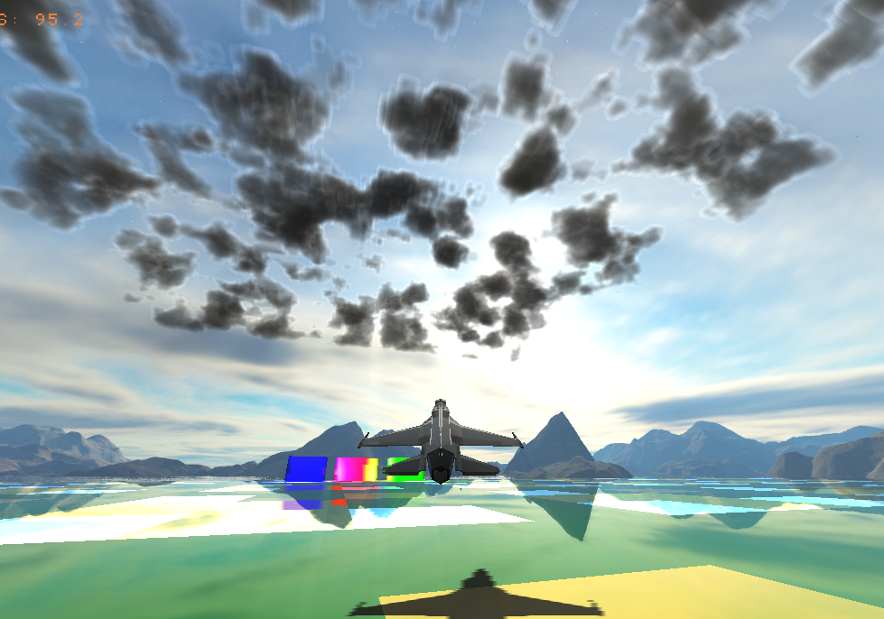
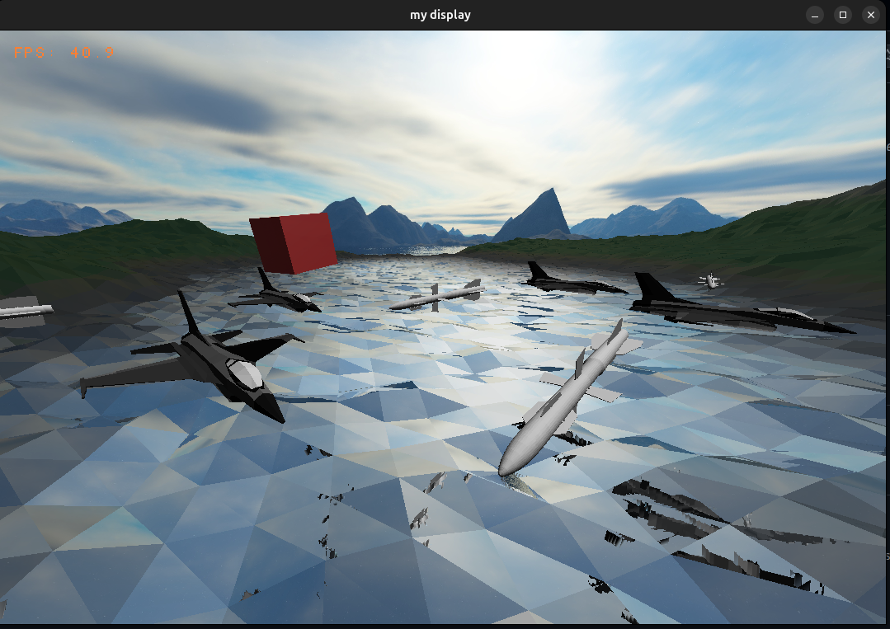

# Tasks

- [ ] reflection have missing emission
- [ ] render scene in HDR to avoid permanent HDR to LDR to HDR steps

- [ ] Map loading files
  - [ ] More primitives like toroid, cone, pyramid ...
  - [ ] Optimalize loading by building multiple bvh at same time not one by one

- [ ] Add back images to repo

- [ ] add MipMaps for textures and add bilinear samplings
  - [ ] mipMaps are generated on object leading
  - [ ] test different implementations for max performance

- [ ] Build some really basic minimalistic model editor
  - [ ] "Tab" toggles "Editor Mode" on/off
    - [ ] click object to select it, use existing model id buffer for highlight (OpenCL: per pixel, if id == selected id, tint color buffer at that pixel)
      - [X] Crete post processing effect to highlight selected object
    - [ ] "1" Move Mode (default), "2" Rotate Mode, "3" Scale Mode
    - [ ] same keys in every mode, only the meaning changes
      - [ ] "Arrow Left/Right" = X, "Arrow Up/Down" = Z, "Right Shift/Right Ctrl" = Y
      - [ ] Move: translate, Rotate: rotate around axis, Scale: scale along axis
    - [ ] WASD stays camera movement, no overlap with object controls
    - [ ] Add debug text to show mode, position, rotation, and scale of the selected model
    - [ ] add snap mode
  - [ ] Crete test and different version to find best method for compute heavy methods

- [ ] implement heat haze
  - [ ] integrate it with object so when objects moves the heat haze  t

- [ ] improve missiles/planes guidence
  - [ ] add support for missiles flight model and improve flight modeling even more
  - [ ] try to train reinforcement learning model for this 
- [ ] Collect images for upscaler
  - [ ] Train torch model for upscaler
  - [ ] Try to extract images directly from war thunder rendering pipeline
  - [ ] Integrate up scaling model
  ```
  # Rendering pipeline with upscaler

  | Stage | T0   | T1           | T2           | T3           |
  |-------|------|--------------|--------------|--------------|
  | CPU   | Img1 | Img2         | Img3         | Img4         |
  | GPU   | -    | Upscale Img1 | Upscale Img2 | Upscale Img3 |
  | Show  | -    | -            | Show Img1    | Show Img2    |

  - CPU: prepare frame N+1 (input, scene update, submit)
  - GPU: upscale frame N (needs history + motion vectors + disocclusion mask tagged with frame N)
  - Show: present frame N-1 (already finished upscaling)
  - Latency: 2 frames from CPU to screen
  - Throughput: max(CPU, GPU, Show), not the sum
  ```

- [ ] Crate open cl rendering kernels for alternative API for rendering and Hybrid approach
  - [ ] Plan: [todo/opencl-raster-hybrid-plan.md](todo/opencl-raster-hybrid-plan.md) — full design, pitfalls, phases
  - [ ] Phase 1 — GPU raster API core (geometry + depth + material color), offscreen-parity vs ray tracer
  - [ ] Phase 2 — textures + material table + base lighting match
  - [ ] Phase 3 — (caller-owned) integration: toggle, near/far split, compositing
  - [ ] Phase 4 — extras (normal maps, specular, culling, tile binning, GPU AO/skybox, async overlap)

- [ ] Add debug build that enables to check the output of each buffer
- [X] Add to agent prompt specific part that model should focus mainly on c part not open cl
- [X] Add to agent prompt specific part of trying to inject ```restrict``` so compiler can be more aggressive and also add focus on alignment of strict for minimal cache misses
- [X] **high** Ambient Occlusion -> **Note**: it works but it is kinda slow and it does not add a lot
  - [X] [Ambient Occlusion tutorial video](https://www.youtube.com/watch?v=XAIfyLpxkfk)
    - [X] Write test of each implementation
    - [X] implement blur pass
    - [X] implement to main render pipeline
    - [X] Implement resolution param now it is too slow for use
      - [X] finetune after this change
    - [ ] Test if open cl is fast enough even when using read backs

- [ ] **high** Overlap AO with the GPU cloud pass instead of running it inside RayTraceScene
  - [ ] Do not just delete the poolWait in RayTraceScene: the pool ring is sized WIDTH (1080) and 720 ray + 720 AO rows overflow it, silently dropping rows.
  - [ ] AO row r samples G-buffer rows r-48..r+48, so every ray row must be finished (FIFO only orders starts, not completions).
  - [ ] Dispatch AO right after RayTraceScene and poolWait only before it is read in main.c, hiding ~4.5-7.6 ms of AO behind the OpenCL cloud pass.

- [ ] **High** Render atmosphere
  - [ ] [Atmosphere rendering](https://www.youtube.com/watch?v=DxfEbulyFcY)

- [x] **High** Light even when behind of geometry (***NOTE***: implement it can be cheaply added)

- [ ] **low** two pass render to remove horizontal artifacts
  - [ ] Benchmark again current implementation
- [ ] **high** Models are too shiny

- [ ] Radar Screen UI
  - [X] test idea
  - [ ] implement
    - [ ] trick where we can use radar ui as mask so renderer will render less pixels
    - [ ] implement so object can show on radar screen we can cheaply reuse the renderer buffer

- [ ] **low** Support for transparent materials

- [ ] Better worker split maybe instead of horizontal lines use vertical (problem is that this will force cpu to jump in image not just one long scan maybe we can change layout)

- [ ] **high** integrated FSR1 to renderer
  - [ ] **low** test other algorithms like FSR2 ...
  - [ ] **low** try to implement own fsr2 like alogo
    - [ ] **low** create motion vectors
    - [ ] **low** train model in pytorch and create open cl / c lib for loading and using cnn kernels / networks
      - [X] generator support for upscaling blocks: `machineLearning/generateKernel.py pixelshuffle 14 14 1 2`
            (torch.nn.PixelShuffle equivalent, valid x1/x2/x3/x4, checked against the PyTorch oracle by
            `llmOpt/ml_bench.py --suite upscale`)

- [ ] **high** test if we can improve guidance
  - [ ] test lowering the dt for simulation when close to target
  - [ ] test switching to genetic algorithm when close to target so we simulate some generation with random mutation and on next generation we cross mutate the top candidates

- [ ] **high** Add audio
  - [X] lib 
  - [X] test volumetric sound first with small demo
    - [ ] implement to real code
      - [ ] Add sound to code base for planes missiles ...
    - [X] implement 3d sound

- [ ] **Not Sure** clouds rendering on gpu
  - [ ] maybe we can pre bake for each voxel the sun reflection distance (trough how many voxels does the ray need to travel to sun)
    - [ ] we can also try to store for example 6 float for each voxel that will define the distance trough claud in each direction and we will interpolate
      - for better quality maybe more

        ```c
        typedef enum {
            DIR_POS_X, DIR_NEG_X,
            DIR_POS_Y, DIR_NEG_Y,
            DIR_POS_Z, DIR_NEG_Z,
            DIR_PXPY, DIR_PXNY, DIR_NXPY, DIR_NXNY,  // xy diagonals
            DIR_PYPZ, DIR_PYNZ, DIR_NYPZ, DIR_NYNZ,  // yz diagonals
            DIR_PXPZ, DIR_PXNZ, DIR_NXPZ, DIR_NXNZ,  // xz diagonals
            DIR_PPP, DIR_PPN, DIR_PNP, DIR_PNN,      // corners
            DIR_NPP, DIR_NPN, DIR_NNP, DIR_NNN,
            DIR_COUNT // 26
        } VoxelDirection;

        struct ClaudVoxel {
            int distToClosestSurfaceOutside;
            int distToClosestSurfaceInside;
            int distToSun;
            int dist[DIR_COUNT]; // flat, static, GPU-serializable
        };
        ```

  - [ ] optimized sky box rendering with SDF

- [ ] test idea of pre pas gpu bbox itersection
  - [ ] we uplod objects bbox and object index and trace rays against them we store per pixel object index if no hit we can set it to -1 then in cpu side we first check the stored index if not hit in bvh we continue normaly
  - [ ] GPU - per pixel bBox check -> store hit object index -> CPU - BVH travers for this object -> if no hit continue with normal traverse

- [ ] Wire frame rendering
- [ ] Crete shader that will simulate hot air fluctuations for jet engine or missiles

- [ ] Create Optimizes versions of this functions
  - [ ] RayCast
    - [ ] **low** opportunity just 0.11% of run time
  - [ ] SampleEmission
    - [ ] **medium/high** opportunity just 1.46% of run time
  - [ ] SampleFace
    - [ ] **notSure** inlined function need to experiment
  - [ ] SampleSkybox
    - [ ] **medium** opportunity just 1.16% of run time
  - [ ] IntersectBVH
    - [ ] **high/max** opportunity just 17.77% of run time
  - [ ] IntersectBVH_Shadow
    - [ ] **medium/high** opportunity just 1.92% of run time
  - [ ] hdrToLDR
    - [ ] **low/median** opportunity just 0.52% of run time
  - [ ] CalculateUvCoordinates
    - [ ] **medium** opportunity just 1.03% of run time
- [X] better instruction like if you make some rendering changes compare performance if performance drop by 10% it is bad and should not be added or should be done better ....

- [ ] train model against moving target
- [ ] disable trust control

- [X] merge the new fixed flight model to main
  - [X] train the model
  - [ ] fix the visualizer
- [ ] Plane editor
  - [ ] export
  - [ ] import to c
  - [ ] implement c wing simulation
- [X] implement the simplified simulation in 2d then move to c
  - [X] move python code to c
  - [ ] train model
    - [ ] train model to go to some to next waypoint but loss will be calculated based on pre calculated curve
  - [ ] integrate the model
  - [ ] add the more advanced version of simulation to main
  - [ ] fix plane sim it feels wrong
- [ ] render directly wia open gl not c => open gl => minifb

- [ ] textures as post proces step on gpu we need to add uv mapping we shoulde use per triangle texture (normal, albedo ...)
  - [ ] input
    - [ ] 2d screen buffers (G-buffer)
      - [ ] Albedo map (HDR above 1 = lit) <- rendered scene color
      - [ ] World space normal map
      - [X] UV map <- done calculated on cpu
      - [ ] Texture ID map
      - [ ] Depth map

    - [ ] light
      - [ ] sun direction
      - [ ] light intensity

    - [ ] texture atlas
      - [ ] Blend Factor
      - [ ] Albedo <- source texture (blend wit base color)
      - [ ] Normal map
      - [ ] Roughness
      - [ ] Metallic

- [ ] model editor / object editor / texture editor

- [ ] GPU rendering (keep it simple — port current CPU pipeline (**later**)
  - [X] clouds
  - [X] god rays

- [ ] Plane controls
  - [ ] Use something like this but we will simplified it
    - [ ] Example : 
    - [ ] Flight model should be physics-based only — derived values like turn rate should not be hardcoded constants
    - [ ] Control by providing a target nose vector (like War Thunder)
      - [ ] Add damping to controls to avoid oscillations

- [ ] Radar / heat seeker simulation for missiles
  - [ ] Simulate radar scanning by sampling object ID buffer over a small cone area and computing RCS on hits
    - [ ] Non-Doppler radar: average terrain clutter hits with target hits to simulate ground return noise
    - [ ] Doppler radar: filter out stationary objects (terrain), track only moving targets (missiles, planes); requires relative velocity per object

- [ ] Missile guidance and control

- [X] new import / export format to support textures
  - [X] add new high quality models
  - [X] test if models are loaded successfully
    - [NotImplemented] use normals for ray tracer handle coloring on gpu

- [X] Create optimized version of rayAABB_inv
  - [NotImplemented] use optimized version processing 8 BoundingBoxes in same time
    - [X] We used rayAABB_inv_x2_soa

- [X] Implement optimized version of RayBoxIntersectV4

- [X] create python llm optimization routine
  - [X] second objective for the ML layer kernels: `llmOpt/scripts/gengin-opt.sh ml`
        (see [llmOpt/README.md](llmOpt/README.md#ml-layer-objective-ml-mode))

- [X] Server integration for multiplayer

- [X] Add screen space reflection

- [X] Test if using multiple rows per ray trace task improves performance (e.g. 8 rows per task)
  - Tested: it is better to use one task per row when there is a lot of work (**more work == fewer rows per task**, **less work == more rows per task**)
    - 

- [X] sync all object
  - [X] why movement si so jerky (jumping around)
- [X] Server Synchronization
  - [X] crete simple project that will test diffrent methods
    - [X] TCP server
    - [X] we can simplify it we crete n planes on each client for while there are not used they are invisible and when user connect one of the planes will be given to user synchronization will work like this

        ```
        on innit => get free plane
        on update => send users plane state and receive new state we can add velocity to each plane so the state will be interpolated between updates
        on close => set planes as free and invisible
        ```

  - [X] integrate it to main.c

- [X] 1. create generic server (async) client (async) and then use lib that is client and server side for model loading updating etc ...
  - [X] reqest designe

    ```c
    #typedef struct {
        uint32 Size
        int Id
        type Type // POST => no repliy, GET => repley
        uint8 data
    } Reqest;
    ```

- [X] God Rays
- [X] Emission
  - [X] crete emission map for each object
    
- [X] Shadows same as reflection
- [X] Clouds
- [X] Bloom
  - [X] Too slow

- [X] Replace screen space refection by raytraced onece
  - [X] use lower resolution and blur row apply it to frame buffer
    - [X] apply direct reflection [red][green][blue][roughness]
      - [X] we blur based on 4th channel

- [X] Clean Up the root dir 

- [X] Configure everywhere where I use open router not to use fp4 / int4 models

  ```json
  {
    "model": "anthropic/claude-3.5-sonnet",
    "messages": [
      { "role": "user", "content": "Hello!" }
      ],
    "provider": {
      "quantizations": ["fp8", "fp16", "bf16", "fp32"]
    }
  }
  ```

- [X] add MCP tool so llm opt know which pr were made

- [X] Add the Sponza palace to scene to test rendering more
  - [X] convert to bin file
  - [X] add to scene
    - [X] fix material issues
    - [X] fix core dump for this object (it works now but not sure if it is correct reason why)

## Current Render



- [ ] Airofoil and flaps simulation
  - 
