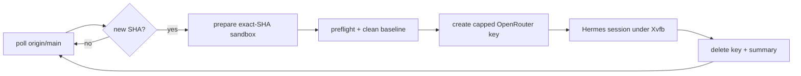

# llmOpt — MCP tool server for the gengin optimizer

Deterministic build/bench/profile/PR tools for the `gengin` CPU ray tracer,
exposed over MCP (stdio) and driven by the [Hermes Agent](https://hermes-agent.nousresearch.com/docs)
harness.  Hermes does editing/search/terminal; this server owns the domain
pipeline: sandbox lifecycle, make/flame/bench, micro-benchmarks, perf
annotation, bisection, and clangd queries.

## Setup

    curl -fsSL https://raw.githubusercontent.com/NousResearch/hermes-agent/main/scripts/install.sh | bash
    pip install -r llmOpt/requirements-mcp.txt
    llmOpt/scripts/setup-hermes.sh      # renders llmOpt/.hermes/{config.yaml,.env}

`setup-hermes.sh` is project-scoped; the global `~/.hermes` config is never touched.

## Run

    llmOpt/scripts/gengin-opt.sh                  # default model (OpenRouter flash)
    llmOpt/scripts/gengin-opt.sh openrouter deepseek/deepseek-v4-pro
    llmOpt/scripts/gengin-opt.sh local            # local llama.cpp server on :8012
    llmOpt/scripts/gengin-opt.sh local Qwen3.8-27B --goal "speed up rayTriangle"
    llmOpt/scripts/gengin-opt.sh deepseek         # direct DeepSeek API (DEEPSEEK_API_KEY)
    llmOpt/scripts/gengin-opt.sh --headless       # unattended oneshot (-z)

The launcher loads `prompts/optimize.md` as the session query; switch models
in-session with `/model custom:local:Qwen3.8-27B`.

### Harness updates

Each launch keeps the Hermes Agent checkout at `origin/main`: a quick
`hermes update --check` (a plain `git fetch`), and the full update when commits
are pending — both best-effort, before the session starts.  Failures log to
`<HERMES_HOME>/harness-update.log` (fallback `/tmp/gengin-harness-update.log`)
and never block a session.  `GENGIN_SKIP_HARNESS_UPDATE=1` disables the
auto-update; `GENGIN_HARNESS_UPDATE_TIMEOUT` (seconds, default 420) bounds it.

## Changing keys

### Local (this machine)

All local secrets live in **`llmOpt/.env`**:

| Variable | Purpose |
|---|---|
| `KEY` | OpenRouter API key for manual `gengin-opt.sh` runs |
| `GITHUB_TOKEN` | Push / PR creation |
| `DEEPSEEK_API_KEY` | Only needed for the `deepseek` preset |

After editing, mirror them into the Hermes environment:

    llmOpt/scripts/setup-hermes.sh

### VM (supervised deployment)

Everything is in **one root-only file**: `/etc/gengin-llmopt/secrets.env`

    OPENROUTER_MANAGEMENT_KEY=sk-or-v1-...
    GITHUB_TOKEN=ghp_...        # optional, enables PR creation

View or rotate (this is the only place to edit):

    sudo cat  /etc/gengin-llmopt/secrets.env
    sudo nano /etc/gengin-llmopt/secrets.env

Then restart whatever runs the supervisor:

    sudo systemctl restart gengin-llmopt     # systemd mode
    # tmux mode: restart the console — /opt/gengin/llmOpt/scripts/supervisor-console.sh

Rules:

- Never put the management key in `llmOpt/.env` on the VM: that file is
  group-readable by the agent, which could then mint unlimited keys.
- Per-session inference keys are created at session start and deleted at the
  end — nothing to manage, no plaintext copy anywhere.
- The same file feeds both systemd (`EnvironmentFile=`) and the tmux launcher
  (passed via stdin — never on a command line, which `ps` exposes to every
  local user).

## Tools (18)

| Group | Tools |
|---|---|
| Build & profiling | `git_pull_project`, `build_project`, `make_bench`, `make_flame`, `create_pr`, `bisect_regression` |
| Micro-bench sandbox | `create_func_bench`, `run_func_bench`, `run_perf_stat`, `delete_func_bench` |
| Hotspot annotation | `hot_annotate_func`, `hot_annotate_file` |
| clangd queries | `lsp_definition`, `lsp_references`, `lsp_call_hierarchy`, `lsp_diagnostics`, `lsp_diagnostics_all` |
| Session control | `report_session_result` (supervised sessions only) |

## Files

| File | Purpose |
|---|---|
| `mcp_server.py` | MCP server (stdio) — the domain tools |
| `main.py` | Build/bench/flame/PR/bisect domain logic |
| `supervisor.py` | Unattended commit-triggered supervisor (VM) |
| `getFunc.py` | C function/struct index + perf line annotation |
| `lsp_client.py` | clangd client (definition/references/diagnostics/call hierarchy) |
| `gen_compile_commands.py` | Generates compile_commands.json for clangd |
| `perf.py` | perf.data → folded stacks → hotspot parser |
| `prompts/optimize.md` | Session workflow (ISOLATION-FIRST loop) |
| `hermes/config.yaml.template` | Project Hermes config template |
| `scripts/setup-hermes.sh` | Renders the template + secrets into `llmOpt/.hermes/` |
| `scripts/gengin-opt.sh` | Session launcher with model selection |
| `scripts/supervisor-console.sh` | Run the supervisor in a tmux console (VM) |
| `codebase_context.md` | Persisted insights: architecture, wins, failures, hotspots |

## Sandbox

All tools operate on `llmOpt/gengin/` — the repo root is never touched until
`create_pr`.  `git_pull_project` refreshes the sandbox (clone + rsync of the
gitignored `deps/`, `assets/`, `.flamegraph/`, `default.profdata`).  Secrets
are never in the checkout — see **Changing keys**.

Benches open a MiniFB window, so the MCP server needs a display: the rendered
config passes `DISPLAY=:2` (this machine's headless Xorg).  Override with
`GENGIN_DISPLAY=<display> llmOpt/scripts/setup-hermes.sh`.  `run_perf_stat` and
`make_flame` need unprivileged perf counters — `llmOpt/scripts/enable-perf.sh`
enables them once (sudo prompt; persists via `/etc/sysctl.d`, with a
`cap_perfmon` fallback).

## Unattended supervisor (`supervisor.py`)

Watches `origin/main`; on a new commit it prepares an exact-SHA sandbox, runs
preflight (build + short bench + Xvfb/GL/OpenCL/perf checks), produces the
full clean baseline, creates a **budget-capped temporary OpenRouter key**,
runs one Hermes session under `Xvfb`, streams its output to journald + a
session log, and cleans up the key on every exit path.  One session at a time;
new commits during a session are coalesced to the newest.



### Configuration

Copy `llmOpt/.env.example` to `llmOpt/.env` and edit (strict parser; unknown
or duplicate keys are rejected; the file is never shell-sourced).  It holds
tuning only — all secrets are stored elsewhere, see **Changing keys**.

### VM installation

```bash
git clone git@github.com:DarkBenky/gengin.git /opt/gengin
sudo bash /opt/gengin/llmOpt/scripts/setup-vm.sh        # Ubuntu 22.04/24.04

# The script creates the two users, installs Hermes as llmopt-agent, seeds
# llmOpt/.env, and seeds the single secrets file — fill in the real keys:
sudo nano /etc/gengin-llmopt/secrets.env

# Then start it (systemd...):
sudo systemctl enable --now gengin-xvfb.service gengin-llmopt.service
journalctl -u gengin-llmopt.service -f

# ...or run it in a tmux console instead (stop the unit first):
tmux new -s llmopt
/opt/gengin/llmOpt/scripts/supervisor-console.sh
```

Session isolation: the per-session Hermes home contains no long-lived
credentials; the temporary inference key is delivered only through the process
environment and deleted at session end.

### Operation

```bash
python3 llmOpt/supervisor.py --status             # sanitized state summary
python3 llmOpt/supervisor.py --dry-run            # resolve config, no side effects
python3 llmOpt/supervisor.py --preflight          # all checks, no key creation
python3 llmOpt/supervisor.py --once               # poll + process at most one SHA
python3 llmOpt/supervisor.py --cleanup-stale-keys # delete owned-prefix keys
```

Exit codes: `0` ok, `1` runtime failure, `2` invalid configuration,
`3` corrupt state.  Runtime state lives in `llmOpt/state/supervisor.json`
(atomic writes, 0600); session logs in `llmOpt/logs/sessions/`; per-session
Hermes home and artifacts in `llmOpt/run/<sessionId>/`.

### Recovery

- **Interrupted session on startup**: the supervisor validates the stored
  process identity (PID + start time), terminates surviving descendants,
  deletes the stored key by hash, writes an `interrupted` summary, and resumes
  polling.
- **Corrupt state file**: quarantined to `supervisor.json.corrupt-<ts>` and the
  supervisor stops (exit 3) for operator review.
- **Failed key deletion**: the hash is retained in `keysPendingDeletion` and
  retried at startup, between poll cycles, and by `--cleanup-stale-keys`.
- **Stale keys**: keys named `gengin-llmopt-*` are reconciled automatically;
  keys outside that prefix are never touched.

### Security model

- Two Unix identities: `llmopt-supervisor` (control plane + management key)
  and `llmopt-agent` (checkout, sandbox, Hermes, GitHub push credential); the
  agent launches through one narrow passwordless `sudoers` helper, with no
  reciprocal sudo.
- The supervisor runs from `/usr/bin/python3`, never from the agent-owned
  virtualenv (a modified venv would run agent code with the management key).
- Secrets: management key + `GITHUB_TOKEN` live in the root-only
  `/etc/gengin-llmopt/secrets.env`; the management key never reaches the
  Hermes/MCP environment; the per-session inference key is budget-capped,
  expiring, and deleted on every exit path (before the summary is written).
- `create_pr` rejects non-descendant bases, empty diffs, forbidden staged
  paths (logs/state/secrets) and secret-looking tokens; it never force-pushes
  and never merges.
- Rotate keys by editing `secrets.env` and restarting — see **Changing keys**.
  Inference keys are ephemeral by design.

### Single-user fallback

Running everything as one user works but is weaker (the agent could read the
management key).  If you do, keep `secrets.env` chmod-600 and treat the
`sudoers`/helper layer as absent.
