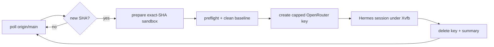

# llmOpt — MCP tool server for the gengin optimizer

Deterministic build/bench/profile/PR tools for the `gengin` CPU ray tracer,
exposed over MCP (stdio) and driven by the [Hermes Agent](https://hermes-agent.nousresearch.com/docs)
harness.  Editing, searching, and terminal work are done by Hermes's built-in
tools; this server owns the domain pipeline: sandbox lifecycle, make/flame/bench,
micro-benchmark sandbox, perf annotation, regression bisection, and clangd queries.

## Setup

1. Install Hermes Agent (once):

       curl -fsSL https://raw.githubusercontent.com/NousResearch/hermes-agent/main/scripts/install.sh | bash

2. Install the MCP dependency:

       pip install -r llmOpt/requirements-mcp.txt

3. Render the project-scoped config:

       llmOpt/scripts/setup-hermes.sh

   This writes `llmOpt/.hermes/config.yaml` and `llmOpt/.hermes/.env` and points
   `HERMES_HOME` there — the global `~/.hermes` config is never touched.

## Run

    llmOpt/scripts/gengin-opt.sh                  # default model (OpenRouter flash)
    llmOpt/scripts/gengin-opt.sh openrouter deepseek/deepseek-v4-pro
    llmOpt/scripts/gengin-opt.sh local            # local llama.cpp server on :8012
    llmOpt/scripts/gengin-opt.sh local Qwen3.8-27B --goal "speed up rayTriangle"
    llmOpt/scripts/gengin-opt.sh deepseek         # direct DeepSeek API (DEEPSEEK_API_KEY)
    llmOpt/scripts/gengin-opt.sh --headless       # unattended: scripted oneshot (-z), no approvals

The launcher loads `prompts/optimize.md` as the session query.  In-session you
can switch models with `/model custom:local:Qwen3.8-27B` or
`/model openrouter:deepseek/deepseek-v4-flash-0731`.

## Tools (18)

| Group | Tools |
|---|---|
| Build & profiling | `git_pull_project`, `build_project`, `make_bench`, `make_flame`, `create_pr`, `bisect_regression` |
| Micro-bench sandbox | `create_func_bench`, `run_func_bench`, `run_perf_stat`, `delete_func_bench` |
| Hotspot annotation | `hot_annotate_func`, `hot_annotate_file` |
| clangd queries | `lsp_definition`, `lsp_references`, `lsp_call_hierarchy`, `lsp_diagnostics`, `lsp_diagnostics_all` |
| Session control | `report_session_result` (supervised sessions only) |

## Files

| File | Purpose |
|---|---|
| `mcp_server.py` | MCP server (stdio) — the 17 domain tools |
| `main.py` | Build/bench/flame/PR/bisect domain logic |
| `getFunc.py` | C function/struct index + perf line annotation |
| `lsp_client.py` | clangd client (definition/references/diagnostics/call hierarchy) |
| `gen_compile_commands.py` | Generates compile_commands.json for clangd |
| `perf.py` | perf.data → folded stacks → hotspot parser |
| `prompts/optimize.md` | Session workflow (ISOLATION-FIRST loop) |
| `hermes/config.yaml.template` | Project Hermes config template |
| `scripts/setup-hermes.sh` | Renders the template + secrets into `llmOpt/.hermes/` |
| `scripts/gengin-opt.sh` | Session launcher with model selection |
| `codebase_context.md` | Persisted insights: architecture, wins, failures, hotspots |

## Sandbox

All tools operate on `llmOpt/gengin/` — the repo root is never touched until
`create_pr`.  `git_pull_project` refreshes the sandbox (clone + rsync of the
gitignored `deps/`, `assets/`, `.flamegraph/`, `default.profdata`).  Secrets
live in `llmOpt/.env` (`KEY`, `GITHUB_TOKEN`) and are mirrored into
`llmOpt/.hermes/.env` by the setup script.

Benches open a MiniFB window, so the MCP server needs a display: the rendered
config passes `DISPLAY=:2` (this machine's headless Xorg).  Override with
`GENGIN_DISPLAY=<display> llmOpt/scripts/setup-hermes.sh`.  `run_perf_stat` and
`make_flame` need unprivileged perf counters — `llmOpt/scripts/enable-perf.sh`
enables them once (sudo prompt; persists via `/etc/sysctl.d`, with a
`cap_perfmon` fallback).

## Unattended supervisor (`supervisor.py`)

Watches `origin/main`; on a new commit it prepares an exact-SHA sandbox, runs
preflight (build + short bench + Xvfb/GL/OpenCL/perf checks), produces the
full clean baseline, creates a **budget-capped temporary OpenRouter key**,
runs one Hermes session under `Xvfb`, streams its output to journald + a
session log, and cleans up the key on every exit path.  One session at a time;
new commits during a session are coalesced to the newest.



### Configuration

Copy `llmOpt/.env.example` to `llmOpt/.env` and edit.  The parser is strict:
unknown or duplicate keys are rejected (the file is never shell-sourced).
The management credential is NOT stored there — supply it via the
`OPENROUTER_MANAGEMENT_KEY` environment variable or the systemd credential
file (preferred).

### VM installation

```bash
git clone git@github.com:DarkBenky/gengin.git /opt/gengin
sudo bash /opt/gengin/llmOpt/scripts/setup-vm.sh        # Ubuntu 22.04/24.04

# The script creates the two users, installs Hermes as llmopt-agent, seeds
# llmOpt/.env (AGENT_USER=llmopt-agent, MCP_VENV=...), and writes a PLACEHOLDER
# management credential — replace it (never in Environment=):
sudo printf 'OPENROUTER_MANAGEMENT_KEY=<management key>\n' \
  > /etc/systemd/credentials/gengin-llmopt/OPENROUTER_MANAGEMENT_KEY
sudo chmod 600 /etc/systemd/credentials/gengin-llmopt/OPENROUTER_MANAGEMENT_KEY

# agent GitHub/SSH credentials (as llmopt-agent), then:
sudo systemctl enable --now gengin-xvfb.service
sudo systemctl enable --now gengin-llmopt.service
journalctl -u gengin-llmopt.service -f
```

The management key reaches the supervisor either through the environment or
through the systemd credential file (`$CREDENTIALS_DIRECTORY`, the unit uses
`LoadCredential=`).  Inference-key isolation: the per-session Hermes home
contains no credentials, and the temporary key is delivered only through the
process environment.

### Operation

```bash
python3 llmOpt/supervisor.py --status             # sanitized state summary
python3 llmOpt/supervisor.py --dry-run            # resolve config, no side effects
python3 llmOpt/supervisor.py --preflight          # all checks, no key creation
python3 llmOpt/supervisor.py --once               # poll + process at most one SHA
python3 llmOpt/supervisor.py --cleanup-stale-keys # delete owned-prefix keys
```

Exit codes: `0` ok, `1` runtime failure, `2` invalid configuration,
`3` corrupt state.  Runtime state lives in `llmOpt/state/supervisor.json`
(atomic writes, 0600); session logs in `llmOpt/logs/sessions/`; per-session
Hermes home and artifacts in `llmOpt/run/<sessionId>/`.

### Recovery

- **Interrupted session on startup**: the supervisor validates the stored
  process identity (PID + start time), terminates surviving descendants,
  deletes the stored key by hash, writes an `interrupted` summary, and resumes
  polling.
- **Corrupt state file**: quarantined to `supervisor.json.corrupt-<ts>` and the
  supervisor stops (exit 3) for operator review.
- **Failed key deletion**: the hash is retained in `keysPendingDeletion` and
  retried at startup, between poll cycles, and by `--cleanup-stale-keys`.
- **Stale keys**: keys named `gengin-llmopt-*` are reconciled automatically;
  keys outside that prefix are never touched.

### Security model

- Two Unix identities: `llmopt-supervisor` (control plane + management key) and
  `llmopt-agent` (checkout, sandbox, Hermes, GitHub push credential).  The
  supervisor launches the agent through a fixed root-owned helper via one
  narrow passwordless `sudoers` rule; the agent has no reciprocal sudo.
- The supervisor runs from the system interpreter (`/usr/bin/python3`), never
  from the agent-owned virtualenv: a modified venv would otherwise execute
  agent-injected code with the management key at the next service restart.
- The management key is exposed only to the supervisor process and is absent
  from the Hermes environment (`/proc/<pid>/environ` verified).
- Hermes filters the MCP child environment; the session variables
  (GENGIN_TARGET_SHA, GENGIN_SESSION_RESULT_PATH, GITHUB_TOKEN, ...) are
  delivered through the per-session `config.yaml` env block, where `${VAR}`
  expands from the supervisor-built environment.  No secret is written to
  that file.
- Temporary keys carry a server-side USD limit, an expiration, and a unique
  session name; deletion is attempted on every exit path, and the key is
  deleted BEFORE the summary is written.
- `create_pr` rejects non-descendant bases, empty diffs, forbidden staged
  paths (logs/state/secrets), and secret-looking tokens; it never force-pushes
  and never merges.
- Rotate the management key by replacing the credential file and restarting
  the service.  Inference keys are ephemeral by design.

### Single-user fallback

Running the supervisor as one user is possible but weaker (the agent could
read the management key).  If you do, keep the management credential
chmod-600, run `llmOpt/scripts/setup-hermes.sh` manually, and treat the
`sudoers`/helper layer as absent.
