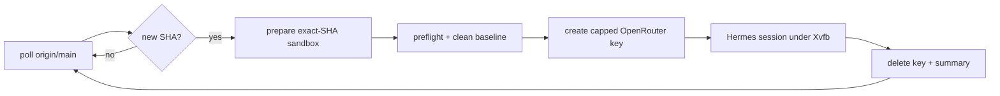

# llmOpt — MCP tool server for the gengin optimizer

Deterministic build/bench/profile/PR tools for the `gengin` CPU ray tracer,
exposed over MCP (stdio) and driven by the [Hermes Agent](https://hermes-agent.nousresearch.com/docs)
harness.  Hermes does editing/search/terminal; this server owns the domain
pipeline: sandbox lifecycle, make/flame/bench, micro-benchmarks, perf
annotation, bisection, and clangd queries.

## Setup

    curl -fsSL https://raw.githubusercontent.com/NousResearch/hermes-agent/main/scripts/install.sh | bash
    pip install -r llmOpt/requirements-mcp.txt
    llmOpt/scripts/setup-hermes.sh      # renders llmOpt/.hermes/{config.yaml,.env}

`setup-hermes.sh` is project-scoped; the global `~/.hermes` config is never touched.

## Run

    llmOpt/scripts/gengin-opt.sh                  # default model (OpenRouter flash)
    llmOpt/scripts/gengin-opt.sh openrouter deepseek/deepseek-v4-pro
    llmOpt/scripts/gengin-opt.sh local            # local llama.cpp server on :8013
    llmOpt/scripts/gengin-opt.sh local Qwen3.8-27B --goal "speed up rayTriangle"
    llmOpt/scripts/gengin-opt.sh deepseek         # direct DeepSeek API (DEEPSEEK_API_KEY)
    llmOpt/scripts/gengin-opt.sh --headless       # unattended oneshot (-z)
    llmOpt/scripts/gengin-opt.sh ml               # ML layer kernels, local GPU (see below)

The launcher loads `prompts/optimize.md` as the session query; switch models
in-session with `/model custom:local:Qwen3.8-27B`.  The `ml` mode loads
`prompts/optimize-ml.md` instead - see **ML layer objective** below.

## ML layer objective (`ml` mode)

Optimizes the OpenCL kernels that `machineLearning/generateKernel.py` emits for
the CNN layers.  Desktop-only: it needs an OpenCL GPU, so the VM never runs it.

    llmOpt/scripts/gengin-opt.sh ml                             # local server (ml default)
    llmOpt/scripts/gengin-opt.sh ml local Qwen3.8-27B --goal "speed up the conv interior path"
    llmOpt/scripts/gengin-opt.sh ml deepseek                    # direct DeepSeek API
    llmOpt/scripts/gengin-opt.sh ml openrouter deepseek/deepseek-v4-pro
    llmOpt/scripts/gengin-opt.sh ml --headless                  # unattended oneshot

`ml` only swaps the session prompt for `prompts/optimize-ml.md`; the provider
words work in any order (`deepseek ml` as well) and default to the local server
when none is given.

Two things a local `ml` run needs: a local model with at least a **64K context
window** (Hermes refuses less - this machine's router serves the 7B at 32K and
restores that fast profile once the 27B has idle-slept for 5 minutes; one request
through `127.0.0.1:8013` wakes the 27B at 262K), and a **sandbox at a commit that
contains `machineLearning/bench/`** - refresh it first with the `git_pull_project`
tool (or `main.git_pull_project(<origin-url>, "main", <sha>)`); a stale sandbox
makes the ML tools answer `predates the layer bench`.  Baselines are shared with
the repo checkout, so a session compares against the timings you pinned here.
`ml deepseek` needs neither and leaves the GPU to the kernel bench.

The session measures first, edits ONLY `machineLearning/generateKernel.py`, and
re-measures before it opens one PR:

    ml_bench(smoke) -> ml_bench(core) -> ml_bench(srnet) -> change -> re-measure -> ml_parity() -> PR

The bench regenerates the kernels from the generator, compiles them with
`/usr/bin/clang`, runs every config on the GPU and compares the output with a
seeded PyTorch oracle (`machineLearning/bench/reference.py`) *before* it reports
speed.  A wrong kernel is a hard failure, never a fast one.

| Tool | Purpose |
|------|---------|
| `ml_bench(generator, suite, configs, kind, reps, capture_baseline)` | run a suite, compare with the pinned baseline |
| `ml_scenarios()` | suites, config ids/shapes, baseline state, defaults |
| `ml_trace(config, reps)` | one config, 50 reps: median/p10/p90, GFLOP/s, deviation |
| `ml_parity()` | the `edges` suite - awkward shapes in one call |

Suites: `smoke` (4), `core` (24), `stress` (9), `edges` (10), `chain` (3),
`upscale` (26), `srnet` (23, the SR upscaler training shapes), `all` (87,
merged without duplicates).  Verdicts: `baseline_captured`, `no_baseline`,
`correctness_failure`, `improved`, `regressed`, `same` - speed only counts as
better or worse when a config clears its own noise band.

### Running the bench by hand

    python3 llmOpt/ml_bench.py --list                    # suites, ids, baseline state
    python3 llmOpt/ml_bench.py --suite core              # compare against the baseline
    python3 llmOpt/ml_bench.py --suite core --capture    # pin it (clean tree only)
    python3 llmOpt/ml_bench.py --configs conv:w28_h28_c1_k3_n16 --json

Baselines live in `llmOpt/ml_baseline.json` (gitignored), one entry per suite
hash and GPU; capturing requires the generator and the tracked artifacts to be
unmodified, so commit before you capture.  `--kind conv|pool|dense|softmax|
shuffle|bilinear` narrows a run to one layer family.

### Generating layers

    python3 machineLearning/generateKernel.py conv 28 28 1 3 16
    python3 machineLearning/generateKernel.py pool 28 28 16 2
    python3 machineLearning/generateKernel.py dense 1568 128
    python3 machineLearning/generateKernel.py softmax 10
    python3 machineLearning/generateKernel.py pixelshuffle 14 14 1 2   # torch.nn.PixelShuffle(2)
    python3 machineLearning/generateKernel.py bilinear 128 128 3 2      # F.interpolate(mode="bilinear")

`pixelshuffle width height channels upscale` is `torch.nn.PixelShuffle(r)` for
the channels-last tensors the other layers use: input `(H, W, channels*r^2)` ->
output `(H*r, W*r, channels)` with
`out[y*r + i][x*r + j][c] = in[y][x][c*r*r + i*r + j]`.  It appends the kernel
plus `KGenPixelShuffle_w<w>_h<h>_c<c>_r<r>_Init/Forward/Run/Destroy` to
`ccnKernel2d.cl` / `kernelGen.h`; the tracked files carry the demo
`pixelshuffle 14 14 1 2`, the x2 upsample of the existing 14x14x4 conv output.
`--out-cl` / `--out-hdr` / `--fresh` generate into scratch files instead (that
is how the bench builds its own kernel set).

`bilinear width height channels upscale` is the align-corners-free bilinear
upscale of the SR net's global skip, for the same channels-last tensors:
`(H, W, C)` -> `(H*r, W*r, C)`.  Its kernel takes an `accumulate` flag
(`out += bilinear(in)`) - that is how `torchToJson.py --arch sr` wires the skip
into the generated `srnet.h`.  The `upscale` suite measures it together with the
SR net's real 128x128 layers (head/residual/tail convs, pixel shuffle, bilinear
skip); the `srnet` suite adds both trained nets' full layer set (64->256 scale 4
and 128->256 scale 2 at C=256), so `ml` sessions tune exactly the kernels that
toolchain emits.

## OpenRouter proxy

Hermes (and anything else pointed at it) reaches OpenRouter through
`llmOpt/proxy/openrouter_proxy.py` on `127.0.0.1:8787`.  It injects
`provider.quantizations` + `allow_fallbacks: false` and appends `:floor` —
one unfiltered retry, then a 1 h cooldown per model — but passes requests
through untouched when the caller pinned something itself:
`provider.only`/`order`, or `:free`.

A provider pin in the model id (`deepseek/deepseek-v4.1-flash:deepseek`,
`xiaomi/mimo-v2.6-flash:xiaomi/fp8`) is a harness convention, not OpenRouter
syntax: OpenRouter's slug only knows `:nitro`/`:floor`/`:free`-style variants
and silently ignores anything else, so the request still succeeds but is load
balanced by price across every provider.  The proxy therefore strips the pin
from the slug and sends it as `provider.order` (exclusive unless
`GENGIN_PROXY_PIN_FALLBACKS=1`), which is the only form OpenRouter honors.
The preflight model check validates pins against the model's endpoint list.

Desktop: `llmOpt/scripts/setup-openrouter-proxy.sh` (user unit).  VM: nothing
to enable — `gengin-llmopt.service` and `supervisor-console.sh` start it (the
console also stops what it started); config wiring (`model.base_url`) is
automatic.  Inspect: `curl 127.0.0.1:8787/status`.  Knobs:
`GENGIN_PROXY_PORT`, `GENGIN_PROXY_QUANTIZATIONS`, `GENGIN_PROXY_FLOOR`,
`GENGIN_PROXY_ALLOW_FALLBACKS`, `GENGIN_PROXY_PIN_FALLBACKS`,
`GENGIN_PROXY_FAIL_THRESHOLD`, `GENGIN_PROXY_COOLDOWN_SECONDS`,
`GENGIN_PROXY_LOG`.

### Harness updates

Each launch keeps the Hermes Agent checkout at `origin/main`: a quick
`hermes update --check` (a plain `git fetch`), and the full update when commits
are pending — both best-effort, before the session starts.  Failures log to
`<HERMES_HOME>/harness-update.log` (fallback `/tmp/gengin-harness-update.log`)
and never block a session.  `GENGIN_SKIP_HARNESS_UPDATE=1` disables the
auto-update; `GENGIN_HARNESS_UPDATE_TIMEOUT` (seconds, default 420) bounds it.

## Changing keys

### Local (this machine)

All local secrets live in **`llmOpt/.env`**:

| Variable           | Purpose                                            |
|--------------------|----------------------------------------------------|
| `KEY`              | OpenRouter API key for manual `gengin-opt.sh` runs |
| `GITHUB_TOKEN`     | Push / PR creation                                 |
| `DEEPSEEK_API_KEY` | Only needed for the `deepseek` preset              |

After editing, mirror them into the Hermes environment:

    llmOpt/scripts/setup-hermes.sh

### VM (supervised deployment)

Everything is in **one root-only file**: `/etc/gengin-llmopt/secrets.env`

    OPENROUTER_MANAGEMENT_KEY=sk-or-v1-...
    GITHUB_TOKEN=ghp_...        # optional, enables PR creation

View or rotate (this is the only place to edit):

    sudo cat  /etc/gengin-llmopt/secrets.env
    sudo nano /etc/gengin-llmopt/secrets.env

Then restart whatever runs the supervisor:

    sudo systemctl restart gengin-llmopt     # systemd mode
    # tmux mode: restart the console — <checkout>/llmOpt/scripts/supervisor-console.sh

Rules:

- Never put the management key in `llmOpt/.env` on the VM: that file is
  group-readable by the agent, which could then mint unlimited keys.
- Per-session inference keys are created at session start and deleted at the
  end — nothing to manage, no plaintext copy anywhere.
- The same file feeds both systemd (`EnvironmentFile=`) and the tmux launcher
  (passed via stdin — never on a command line, which `ps` exposes to every
  local user).

## Tools (24)

| Group               | Tools                                                                                              |
|---------------------|----------------------------------------------------------------------------------------------------|
| Build & profiling   | `git_pull_project`, `build_project`, `make_bench`, `make_flame`, `create_pr`, `bisect_regression`  |
| ML layer kernels    | `ml_bench`, `ml_scenarios`, `ml_trace`, `ml_parity`                                                |
| Micro-bench sandbox | `create_func_bench`, `run_func_bench`, `run_perf_stat`, `delete_func_bench`                        |
| Visual evidence     | `compare_bench_frames`, `compare_images`                                                           |
| Hotspot annotation  | `hot_annotate_func`, `hot_annotate_file`                                                           |
| clangd queries      | `lsp_definition`, `lsp_references`, `lsp_call_hierarchy`, `lsp_diagnostics`, `lsp_diagnostics_all` |
| Session control     | `report_session_result` (supervised sessions only)                                                 |

Visual changes are opt-in: `make_bench(allow_visual_change=true)` (SSIM gate),
then `compare_bench_frames` writes `before | after | diff` composites + metrics
to `screenshots/visual/`, and `create_pr(imageOutputChange=true,
compareImagePaths=[...])` opens a `[visual]` PR (min SSIM 0.95, evidence
embedded).

## Files

| File                            | Purpose                                                          |
|---------------------------------|------------------------------------------------------------------|
| `mcp_server.py`                 | MCP server (stdio) — the domain tools                            |
| `main.py`                       | Build/bench/flame/PR/bisect domain logic                         |
| `supervisor.py`                 | Unattended commit-triggered supervisor (VM)                      |
| `getFunc.py`                    | C function/struct index + perf line annotation                   |
| `lsp_client.py`                 | clangd client (definition/references/diagnostics/call hierarchy) |
| `gen_compile_commands.py`       | Generates compile_commands.json for clangd                       |
| `perf.py`                       | perf.data → folded stacks → hotspot parser                       |
| `prompts/optimize.md`           | Session workflow (ISOLATION-FIRST loop)                          |
| `prompts/optimize-ml.md`        | Session workflow for the ML layer objective (`ml` mode)           |
| `ml_bench.py`                   | Layer suites, PyTorch gate, baselines, verdicts (CLI + library)   |
| `ml_baseline.json`              | Pinned per-suite timings per GPU (generated, gitignored)          |
| `hermes/config.yaml.template`   | Project Hermes config template                                   |
| `scripts/setup-hermes.sh`       | Renders the template + secrets into `llmOpt/.hermes/`            |
| `scripts/gengin-opt.sh`         | Session launcher with model selection                            |
| `scripts/supervisor-console.sh` | Run the supervisor in a tmux console (VM)                        |
| `codebase_context.md`           | Insights: architecture, wins, failures, hotspots (local, gitignored)  |

## Sandbox

All tools operate on `llmOpt/gengin/` — the repo root is never touched until
`create_pr`.  `git_pull_project` refreshes the sandbox (clone + rsync of the
gitignored `deps/`, `assets/`, `.flamegraph/`, `default.profdata`).  Secrets
are never in the checkout — see **Changing keys**.

Benches open a MiniFB window, so the MCP server needs a display: the rendered
config passes `DISPLAY=:2` (this machine's headless Xorg).  Override with
`GENGIN_DISPLAY=<display> llmOpt/scripts/setup-hermes.sh`.  `run_perf_stat` and
`make_flame` need unprivileged perf counters — `llmOpt/scripts/enable-perf.sh`
enables them once (sudo prompt; persists via `/etc/sysctl.d`, with a
`cap_perfmon` fallback).

## Unattended supervisor (`supervisor.py`)

Watches `origin/main`; on a new commit it prepares an exact-SHA sandbox, runs
preflight (build + short bench + Xvfb/GL/OpenCL/perf checks), produces the
full clean baseline, creates a **budget-capped temporary OpenRouter key**,
runs one Hermes session under `Xvfb`, streams its output to journald + a
session log, and cleans up the key on every exit path.  One session at a time;
new commits during a session are coalesced to the newest.


```mermaid
flowchart LR
    A[poll origin/main] --> B{new SHA?}
    B -- yes --> C[prepare exact-SHA sandbox]
    C --> D[preflight + clean baseline]
    D --> E[create capped OpenRouter key]
    E --> F[Hermes session under Xvfb]
    F --> G[delete key + summary]
    G --> A
    B -- no --> A
```

### Configuration

Copy `llmOpt/.env.example` to `llmOpt/.env` and edit (strict parser; unknown
or duplicate keys are rejected; the file is never shell-sourced).  It holds
tuning only — all secrets are stored elsewhere, see **Changing keys**.

### VM installation

Clone the repo anywhere and use that directory as `<checkout>`:

```bash
git clone git@github.com:DarkBenky/gengin.git <checkout>
sudo bash <checkout>/llmOpt/scripts/setup-vm.sh --checkout <checkout>   # Ubuntu 22.04/24.04

# The script creates the two users, installs Hermes as llmopt-agent, seeds
# llmOpt/.env, and seeds the single secrets file — fill in the real keys:
sudo nano /etc/gengin-llmopt/secrets.env

# Then start it (systemd...):
sudo systemctl enable --now gengin-xvfb.service gengin-llmopt.service
journalctl -u gengin-llmopt.service -f

# ...or run it in a tmux console instead (stop the unit first):
tmux new -s llmopt
<checkout>/llmOpt/scripts/supervisor-console.sh
```

Session isolation: the per-session Hermes home contains no long-lived
credentials; the temporary inference key is delivered only through the process
environment and deleted at session end.

### Changing the session model (VM)

Sessions run the model from `OPENROUTER_MODEL` in the checkout's `llmOpt/.env`
(no CLI flag):

```bash
sudo <checkout>/llmOpt/scripts/set-openrouter-model.sh z-ai/glm-5.3-flash:floor
```

It rewrites the line (timestamped backup) and restarts `gengin-llmopt.service`
when it runs — that terminates an in-flight session; with the tmux console,
restart the pane instead.

### Updating the VM checkout

The supervisor runs from the checkout, so new code and prompts need a pull plus a
restart:

```bash
cd <checkout>
git pull
python3 llmOpt/supervisor.py --status       # sanity check
sudo systemctl restart gengin-llmopt        # systemd mode
# tmux mode: Ctrl-C in the console pane, then <checkout>/llmOpt/scripts/supervisor-console.sh
```

`llmOpt/codebase_context.md` is **gitignored now** (one knowledge base per
checkout), so it never blocks a pull again.  Sessions read the checkout's copy
(their sandbox gets it from `git_pull_project`) and their insights stay in that
file on the machine that produced them; to move knowledge between machines, copy
the file by hand.

The MCP server is spawned per session, so it picks up changes automatically, and
`prompts/*.md` is read per session too - the restart is for `supervisor.py` itself.

### Operation

```bash
python3 llmOpt/supervisor.py --status             # sanitized state summary
python3 llmOpt/supervisor.py --dry-run            # resolve config, no side effects
python3 llmOpt/supervisor.py --preflight          # all checks, no key creation
python3 llmOpt/supervisor.py --once               # poll + process at most one SHA
python3 llmOpt/supervisor.py --cleanup-stale-keys # delete owned-prefix keys
```

Exit codes: `0` ok, `1` runtime failure, `2` invalid configuration,
`3` corrupt state.  Runtime state lives in `llmOpt/state/supervisor.json`
(atomic writes, 0600); session logs in `llmOpt/logs/sessions/`; per-session
Hermes home and artifacts in `llmOpt/run/<sessionId>/`.

### Recovery

- **Interrupted session on startup**: the supervisor validates the stored
  process identity (PID + start time), terminates surviving descendants,
  deletes the stored key by hash, writes an `interrupted` summary, and resumes
  polling.
- **Corrupt state file**: quarantined to `supervisor.json.corrupt-<ts>` and the
  supervisor stops (exit 3) for operator review.
- **Failed key deletion**: the hash is retained in `keysPendingDeletion` and
  retried at startup, between poll cycles, and by `--cleanup-stale-keys`.
- **Stale keys**: keys named `gengin-llmopt-*` are reconciled automatically;
  keys outside that prefix are never touched.

### Security model

- Two Unix identities: `llmopt-supervisor` (control plane + management key)
  and `llmopt-agent` (checkout, sandbox, Hermes, GitHub push credential); the
  agent launches through one narrow passwordless `sudoers` helper, with no
  reciprocal sudo.
- The supervisor runs from `/usr/bin/python3`, never from the agent-owned
  virtualenv (a modified venv would run agent code with the management key).
- Secrets: management key + `GITHUB_TOKEN` live in the root-only
  `/etc/gengin-llmopt/secrets.env`; the management key never reaches the
  Hermes/MCP environment; the per-session inference key is budget-capped,
  expiring, and deleted on every exit path (before the summary is written).
- `create_pr` rejects non-descendant bases, empty diffs, forbidden staged
  paths (logs/state/secrets) and secret-looking tokens; it never force-pushes
  and never merges.
- Rotate keys by editing `secrets.env` and restarting — see **Changing keys**.
  Inference keys are ephemeral by design.

### Single-user fallback

Running everything as one user works but is weaker (the agent could read the
management key).  If you do, keep `secrets.env` chmod-600 and treat the
`sudoers`/helper layer as absent.
