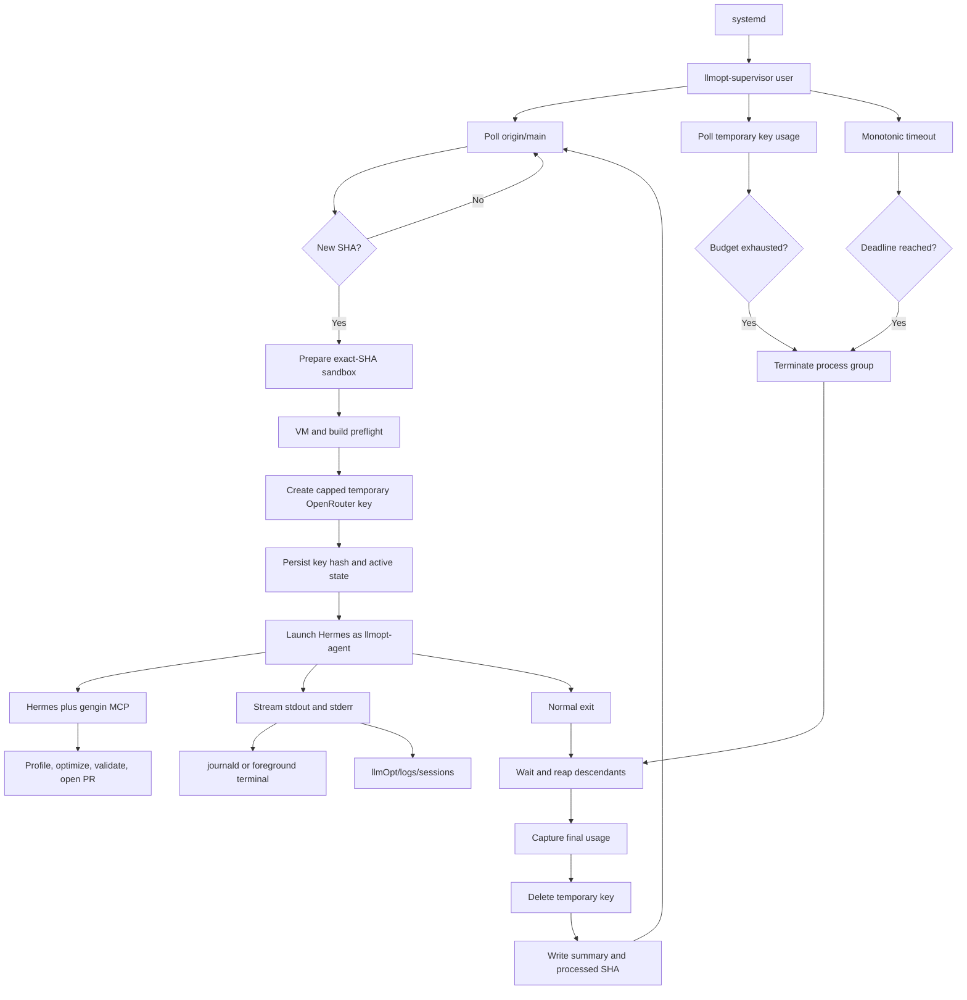

# TODO: Commit-Triggered VM Optimizer

## 1. Purpose

Build an unattended Linux VM service around the existing `llmOpt` Hermes/MCP
optimizer. The service must watch the newest commit on `origin/main`, prepare an
exact-commit sandbox, create a temporary OpenRouter inference key with a hard
USD budget, launch Hermes with the configured model, stream the complete
available session output to both the terminal and a private log file, enforce a
wall-clock deadline, revoke the temporary key, and automatically open a pull
request when the agent produces a validated optimization.

This document is the implementation specification. A developer should be able
to execute it without guessing about lifecycle, security, retry, or state
semantics.

## 2. Decisions Already Made

- Deployment target: Ubuntu Linux VM managed by systemd.
- Watched ref: only `refs/heads/main` on the configured remote.
- Commit policy: process the newest main commit; coalesce intermediate commits
  that arrive while a session is active.
- First startup: record the current remote SHA without launching unless
  `RUN_ON_START=true`.
- Concurrency: one supervisor and at most one optimization session.
- Result: automatically push one focused branch and open one pull request.
- Merge policy: never merge automatically.
- Rendering: preserve the existing renderer by using Xvfb, Mesa software GL,
  and a CPU OpenCL implementation such as PoCL.
- Budget enforcement: a separate OpenRouter key per session with a server-side
  USD spending limit. Local monitoring supplements the provider limit.
- Time enforcement: terminate the complete Hermes process group at the
  configured monotonic deadline.
- Runtime output: duplicate the output visible in the service terminal/journal
  into `llmOpt/logs/sessions/`.
- Secrets, logs, runtime state, generated Hermes state, and the sandbox stay out
  of Git.
- Preserve the existing Hermes/MCP optimization workflow. Do not replace
  Hermes with a custom agent loop in this work.
- Do not change existing C struct names or fields.

## 3. Current Repository Facts

Understand these facts before changing anything:

1. `llmOpt/scripts/gengin-opt.sh` already supports Hermes one-shot mode with
   `--headless`, `hermes -z`, `--yolo`, and `--usage-file`.
2. In this repository, "headless" currently means noninteractive Hermes. It
   does not mean the renderer is display-free.
3. `main.c` always opens a MiniFB window. `BENCH_MODE` suppresses overlay text
   but does not skip `mfb_open_ex`, input polling, or `mfb_update`.
4. The executable links MiniFB, X11, Xrandr, OpenGL, JPEG, pthread, math, and
   OpenCL.
5. The cloud renderer initializes and executes OpenCL code. A VM without an
   OpenCL ICD will fail even if Xvfb is available.
6. `main.c` creates a client for `127.0.0.1:8081` and performs object GET/POST
   calls. Connection refusal is tolerated, but these calls add nondeterministic
   benchmark work and error paths.
7. `llmOpt/main.py` owns sandbox clone/build/bench/profile/PR operations.
8. `llmOpt/mcp_server.py` exposes those operations to Hermes and sets the
   sandbox to `llmOpt/gengin`.
9. `git_pull_project()` currently deletes the sandbox, clones the latest remote
   repository, and then copies ignored dependencies/assets from the parent
   checkout. It does not pin a SHA and can destroy useful state before clone
   success.
10. The parent checkout is currently the source for ignored `deps`, `assets`,
    `.flamegraph`, and `default.profdata` content needed by a fresh clone.
11. `makeBench()` runs five complete benchmark executions and median-aggregates
    scalar metrics. It also compares captured frame images.
12. The Makefile's `make flame` path writes perf data beneath `build/prof/`, but
    `llmOpt/perf.py` currently expects `perf.data` at the supplied working
    directory root. This integration must be reconciled before unattended
    profiling can be trusted.
13. `llmOpt/scripts/setup-hermes.sh` currently mirrors long-lived keys into
    `llmOpt/.hermes/.env`. Supervisor mode must not persist temporary keys.
14. `createPR()` creates a branch, stages everything, commits, pushes, and calls
    the GitHub REST API. It needs exact-base and empty-diff guards.
15. `.gitignore` already excludes `llmOpt/.env`, `llmOpt/.hermes/`,
    `llmOpt/gengin`, and the baseline cache. It does not yet explicitly exclude
    the proposed logs and supervisor state directories.
16. `llmOpt/requirements-mcp.txt` currently contains only `mcp>=1.27,<2`.
    Prefer Python standard-library HTTP and configuration code for the
    supervisor unless an external dependency has a clear benefit.
17. A fresh commit does not currently have a reliable performance baseline.
  The prompt calls `make_bench` after edits, while `_loadBaselineCache()`
  rejects its cache when the sandbox is dirty. The first post-edit benchmark
  can therefore become the baseline instead of being compared with clean
  `HEAD`. This must be fixed before unattended optimization.
18. A fresh VM clone may not contain the ignored/prebuilt inputs copied by
  `git_pull_project()`. VM provisioning needs an explicit, verified source
  for those files rather than assuming another complete checkout exists.

## 4. Desired Architecture



### Trust boundary

Use two Unix identities if the VM permits it:

- `llmopt-supervisor` owns the process supervisor and can read the OpenRouter
  management credential. It must not perform source edits or builds.
- `llmopt-agent` owns the checkout, `llmOpt/gengin`, `.hermes`, logs, and GitHub
  push credentials. It receives only the short-lived inference key.

This separation matters. If the management key is inherited by Hermes, the
agent or any command it runs can create unlimited new inference keys and bypass
the intended budget. Removing an environment variable in Python is not enough
if the agent account can read the original service environment file. File
permissions and Unix ownership must enforce the boundary.

An unprivileged `llmopt-supervisor` process cannot directly change its UID to
`llmopt-agent`. Install one root-owned, narrowly scoped `sudoers` rule that lets
the supervisor execute only a fixed root-owned agent-launch helper as
`llmopt-agent`, without a password. The agent account must have no reciprocal
sudo permission. Do not construct a general `sudo -u llmopt-agent sh -c ...`
escape hatch.

The supervisor source, launcher helper, systemd unit, and configuration schema
must be root-owned and not writable by `llmopt-agent`. Otherwise the coding
agent could modify code that later runs with access to the management key.
Only the sandbox, per-session Hermes home, run artifacts, and session logs
should be writable by the agent. Use a shared group only for narrowly selected
runtime directories, not the control-plane source or secret directory.

If two Unix users are impractical for the first prototype, document that the
single-user mode is weaker, make it opt-in, and still construct the Hermes
environment from an allowlist. Do not present single-user mode as equivalent
security.

## 5. Proposed Files

### New files

- `llmOpt/supervisor.py`: polling state machine, preflight orchestration,
  subprocess supervision, output streaming, budget polling, cleanup, and state
  persistence.
- `llmOpt/openrouter_keys.py`: narrow OpenRouter management/current-key API
  client.
- `llmOpt/.env.example`: documented nonsensitive configuration template.
- `llmOpt/scripts/setup-vm.sh`: repeatable supported-VM provisioning.
- `llmOpt/systemd/gengin-llmopt.service`: systemd service template.
- `llmOpt/systemd/gengin-xvfb.service`: optional dedicated Xvfb unit if Xvfb is
  not launched by the main service.

### Existing files to modify

- `llmOpt/main.py`: exact-SHA sandbox replacement, profiling path correction,
  and safer PR creation.
- `llmOpt/mcp_server.py`: enforce target SHA and expose safe sandbox refresh.
- `llmOpt/scripts/gengin-opt.sh`: supervisor-safe launch mode and explicit
  output paths.
- `llmOpt/scripts/setup-hermes.sh`: no persistence of temporary inference keys.
- `llmOpt/hermes/config.yaml.template`: VM display and MCP environment wiring.
- `llmOpt/prompts/optimize.md`: pinned commit and unattended completion rules.
- `llmOpt/perf.py`: consume the artifact generated by the current Makefile.
- `main.c`: avoid client networking only in `BENCH_MODE`.
- `.gitignore`: runtime logs/state/generated files.
- `llmOpt/README.md`: installation, operation, recovery, and security guidance.

## 6. Configuration Contract

Create `llmOpt/.env.example` with every supported setting and a short comment.
Do not put real values in this file.

```dotenv
# Repository and polling
GENGIN_REPO_URL=git@github.com:DarkBenky/gengin.git
GENGIN_INPUTS_DIR=/var/lib/gengin-llmopt/inputs
WATCH_REMOTE=origin
WATCH_BRANCH=main
POLL_INTERVAL_SECONDS=300
RUN_ON_START=false
MAX_SETUP_RETRIES=3
RETRY_BASE_SECONDS=30
RETRY_MAX_SECONDS=1800

# Agent and OpenRouter
OPENROUTER_MODEL=deepseek/deepseek-v4-flash-0731
OPENROUTER_BUDGET_USD=5.00
SESSION_TIMEOUT_SECONDS=14400
BUDGET_POLL_SECONDS=15
KEY_EXPIRY_GRACE_SECONDS=900
TERMINATION_GRACE_SECONDS=30

# VM runtime
GENGIN_DISPLAY=:99
LIBGL_ALWAYS_SOFTWARE=1
HEADLESS_MODE=xvfb
PREFLIGHT_BENCH_DURATION_SECONDS=2
REQUIRE_PERF=true

# Runtime storage
LOG_RETENTION_DAYS=30
STATE_DIR=llmOpt/state
SESSION_LOG_DIR=llmOpt/logs/sessions
RUN_DIR=llmOpt/run
```

The implementation reads nonsensitive settings from `llmOpt/.env`. Define a
strict parser for blank lines, comments, and `KEY=VALUE` entries; document
whether single/double quotes are supported. Reject duplicate keys and unknown
keys so misspellings cannot silently select defaults. Do not execute or shell
source `.env`.

The existing `KEY=` convention means a reusable OpenRouter inference key.
Deprecate it for supervisor mode. Migration must remove `KEY`,
`DEEPSEEK_API_KEY`, and other cloud-provider credentials from the supervised
Hermes profile so every paid model request is forced through the capped
temporary OpenRouter key. Manual launcher profiles may remain separate.

The OpenRouter management key must be supplied separately, preferably through
a systemd credential:

```text
OPENROUTER_MANAGEMENT_KEY=<management key, not an inference key>
```

`GITHUB_TOKEN` and the SSH private key belong to the agent identity. Prefer a
GitHub App or fine-grained token restricted to this repository with only the
permissions needed to push a branch and create a pull request.

### Startup validation

Before polling, validate all configuration in one pass and report every error:

- `WATCH_BRANCH`, repository URL, and model are nonempty.
- Model contains a provider/model separator unless OpenRouter explicitly
  supports the configured alias.
- Budget parses as a finite decimal and is greater than zero.
- Timeout, poll intervals, retry values, and retention are bounded positive
  integers.
- `BUDGET_POLL_SECONDS < SESSION_TIMEOUT_SECONDS`.
- Key expiry grace is greater than termination grace.
- Paths resolve beneath the repository or an explicitly approved runtime root.
- `GENGIN_INPUTS_DIR` is absolute, read-only to the agent during sessions, and
  contains a valid versioned manifest.
- `HEADLESS_MODE` is one of the implemented values. Initially only `xvfb` is
  supported.
- The management credential is present and is never printed.

Exit with code 2 for invalid configuration. Do not enter a retry loop for an
operator configuration error.

## 7. Supervisor Command-Line Contract

Implement these commands in `llmOpt/supervisor.py`:

```text
python3 llmOpt/supervisor.py run
python3 llmOpt/supervisor.py --preflight
python3 llmOpt/supervisor.py --once
python3 llmOpt/supervisor.py --dry-run
python3 llmOpt/supervisor.py --status
python3 llmOpt/supervisor.py --cleanup-stale-keys
```

- `run`: persistent polling loop used by systemd.
- `--preflight`: validate configuration, tools, display, OpenCL, checkout,
  build, and short benchmark without creating an inference key.
- `--once`: poll and process at most one eligible SHA, then exit.
- `--dry-run`: resolve configuration and report what would run without changing
  state, cloning, creating keys, or launching Hermes.
- `--status`: read state and print a sanitized human-readable summary.
- `--cleanup-stale-keys`: reconcile supervisor-created OpenRouter keys without
  launching Hermes.

Do not combine mutually exclusive modes. Return nonzero for failed preflight or
cleanup that still leaves a known live key.

## 8. Persistent State Contract

Store state in `llmOpt/state/supervisor.json`. Write to a temporary file in the
same directory, flush, `fsync`, and atomically rename it. Use restrictive file
permissions. Include a schema version for future migration.

Example:

```json
{
  "schemaVersion": 1,
  "lastObservedSha": "0123456789abcdef0123456789abcdef01234567",
  "lastProcessedSha": "0123456789abcdef0123456789abcdef01234567",
  "pendingSha": null,
  "setupFailures": {},
  "activeSession": null,
  "keysPendingDeletion": []
}
```

Active session example:

```json
{
  "sessionId": "20260917T120000Z-01234567-a1b2c3d4",
  "targetSha": "0123456789abcdef0123456789abcdef01234567",
  "keyHash": "OpenRouter key hash, never plaintext",
  "startedAt": "2026-09-17T12:00:00Z",
  "deadlineAt": "2026-09-17T16:00:00Z",
  "pid": 1234,
  "processGroupId": 1234,
  "logPath": "llmOpt/logs/sessions/...log",
  "usagePath": "llmOpt/run/...usage.json"
}
```

### State invariants

- No plaintext API key is ever written.
- `activeSession` becomes non-null only after key creation succeeds and before
  Hermes starts.
- `lastProcessedSha` is updated when Hermes successfully starts, not only when
  it succeeds. This avoids spending repeatedly on a broken agent session.
- Preflight/setup failure does not mark a SHA processed until it reaches the
  deterministic failure quarantine threshold.
- A newer observed SHA replaces an older pending SHA.
- A key hash remains in either `activeSession` or `keysPendingDeletion` until a
  successful delete or confirmed 404.

### Locking

Acquire `llmOpt/state/supervisor.lock` with a nonblocking advisory OS lock.
Write the supervisor PID for diagnostics, but rely on the lock rather than PID
contents for correctness. A second process exits cleanly and reports the owner.

## 9. Commit Detection Semantics

Query exactly this remote ref:

```bash
git ls-remote --exit-code "$GENGIN_REPO_URL" "refs/heads/$WATCH_BRANCH"
```

Strictly require one result and validate the object ID. Do not parse `git log`
from a potentially stale local checkout.

### Polling behavior

1. Load valid state and acquire the lock.
2. Reconcile an interrupted session and stale keys.
3. Query the remote main SHA.
4. If state is new and `RUN_ON_START=false`, set observed and processed SHA to
   the current tip without launching.
5. If the tip differs from `lastProcessedSha`, set it as pending.
6. Prepare and run the pending SHA.
7. While a session is active, continue checking the deadline and budget. A
   separate lightweight polling timer may also refresh the remote SHA, but it
   must not start another session.
8. On completion, query the remote again. If several commits arrived, retain
   only the newest tip and run that next.

Do not trigger for tags, pull request refs, optimization branches, or force
pushes that leave the same main object ID.

### Force-push behavior

Treat a different main SHA as new even if it is not a descendant. Record in the
session summary whether the new target was a descendant of the previous target.
Do not attempt to rewrite or close existing PRs automatically.

## 10. Exact-SHA Sandbox Preparation

Change `git_pull_project()` to accept explicit inputs rather than embedding a
repository URL:

```python
def git_pull_project(repo_url: str, branch: str, target_sha: str) -> None:
    ...
```

Required algorithm:

1. Resolve the absolute `llmOpt` directory.
2. Create a temporary sibling such as `llmOpt/gengin.prepare-<sessionId>`.
3. Clone or initialize/fetch only the required branch and commit. Do not assume
   the SHA remains branch tip after detection.
4. Checkout detached `target_sha`.
5. Verify `git rev-parse HEAD` equals the requested SHA exactly.
6. Verify the commit is reachable from the configured branch at detection time
   where possible. A force push during preparation is acceptable only if the
   requested commit was already successfully fetched.
7. Sync required ignored inputs from the configured stable source:
   `deps/`, `assets/`, `.flamegraph/`, and the applicable profile data.
8. Generate `compile_commands.json` for the new sandbox.
9. Run structural checks for expected source and asset files.
10. Rename the current sandbox to a backup, rename the prepared sandbox into
    place, then delete the backup only after success.
11. On failure, delete the temporary preparation directory and preserve the
    previous sandbox.

Avoid `rm -rf` on paths built from unchecked configuration. Resolve the target
and verify it is exactly the expected sandbox child before deleting or
renaming.

`GENGIN_INPUTS_DIR` must be provisioned independently of the mutable checkout.
Store a manifest containing filenames, sizes, and SHA-256 hashes for required
prebuilt libraries, model binaries, fonts, and other ignored assets. Verify the
manifest before each sandbox replacement and record its own hash in the
session summary. Do not silently copy partial inputs with
`--ignore-missing-args`; missing required data is a preflight failure. This
also prevents two runs of the same Git SHA from using different binary assets.

Set `GENGIN_TARGET_SHA`, `GENGIN_REPO_URL`, and `GENGIN_TARGET_BRANCH` in the
MCP child environment. Any MCP `git_pull_project` call must use these values.
The agent must not be able to accidentally replace its code with a later main
commit during the session.

### Baseline contract

Create the full clean performance baseline before model spending, after the
exact sandbox and VM checks succeed. Store it with all inputs needed to decide
whether it is reusable:

- Exact Git SHA.
- Input-manifest hash.
- Makefile/compiler flags hash.
- Compiler version.
- CPU model and vCPU count.
- Kernel version and CPU governor where available.
- OpenCL platform/device and Mesa renderer.
- Benchmark duration/run count.

Change `_loadBaselineCache()` so a baseline captured from clean `HEAD` can be
loaded after the agent makes working-tree edits, provided the cached SHA and
environment fingerprint still match. Dirty working-tree state must prevent
creating a new baseline, not prevent reading a known clean baseline. Write the
cache atomically.

The MCP process must load this clean baseline before comparing post-edit runs.
The agent prompt should still require an initial `make_bench` check, but it
must report that it loaded/confirmed the prepared baseline rather than silently
establishing a baseline from modified code. If a valid clean baseline is not
available, `make_bench` must fail with an actionable error instead of accepting
the current dirty result as baseline.

## 11. Preflight Before Spending Money

Run all deterministic and infrastructure checks before creating an inference
key. Return structured check results so logs clearly show the failing stage.

### Required tools

- `git`
- `make`
- `clang`
- `/usr/bin/ld`
- `python3`
- `hermes`
- `clangd`
- `perf` when `REQUIRE_PERF=true`
- `rsync`
- `Xvfb` or a healthy already-running display
- `xdpyinfo`
- `glxinfo`
- `clinfo`
- `perl`
- `dot` and `gprof2dot` when call graphs are required

### Required checks

1. Remote repository read succeeds without an interactive prompt.
2. The agent account can write sandbox, `.hermes`, run, state-visible metadata,
   and log directories as intended.
3. The supervisor can read its management credential but the agent account
   cannot.
4. Hermes config validation succeeds with project-scoped `HERMES_HOME`.
5. MCP's Python interpreter can import `mcp`.
6. `DISPLAY=:99 xdpyinfo` succeeds.
7. `glxinfo -B` reports a renderer. Software rendering is expected on a CPU VM.
8. `clinfo` reports at least one usable platform and device.
9. Required MiniFB headers and static library exist.
10. Required model/assets exist, including files used by `main.c`.
11. A clean `make` succeeds in the exact-SHA sandbox.
12. A shortened benchmark succeeds and emits valid
    `bench/results/bench_results.json`.
13. If required, perf can collect a minimal noninteractive sample without sudo.
14. UTC time is synchronized closely enough to create valid key expiration
  timestamps; use a monotonic clock for elapsed deadlines regardless.
15. Free disk and inode capacity can hold a sandbox backup, compiler outputs,
  profile data, Hermes state, and the configured log allowance.
16. The configured OpenRouter model exists and is currently eligible for the
  account/routing policy where the API can determine this without spending.
17. The OpenRouter account has sufficient available credit for the requested
  per-session limit. Failure to prove account credit must not create a key.
18. A full clean baseline with the current environment fingerprint has been
  produced and atomically cached.

The normal `make bench` is expensive because `makeBench()` performs five runs.
Implement a separate preflight smoke duration/iteration override rather than
using the full production baseline loop.

### Failure classification

Transient and retryable:

- DNS/network outage.
- Remote 429 or 5xx.
- Xvfb service temporarily unavailable.
- Temporary filesystem/resource pressure.

Deterministic until configuration/code changes:

- Invalid `.env`.
- Missing binary/package.
- Checkout SHA mismatch.
- Compile error on the target commit.
- Missing required asset.
- No OpenCL implementation.
- Persistent benchmark crash.

Retry transient failures with exponential backoff and jitter. Count
deterministic failures per SHA. After `MAX_SETUP_RETRIES`, write a quarantined
summary and mark that SHA handled so a broken commit cannot block every newer
commit forever.

## 12. OpenRouter API Client

Implement a small client in `llmOpt/openrouter_keys.py`. Use
`urllib.request`/`urllib.error`, explicit timeouts, bounded response reads, and
strict JSON validation. Never include authorization headers or complete
responses containing a key in exceptions.

Base URL:

```text
https://openrouter.ai/api/v1
```

### Create a session key

```http
POST /keys
Authorization: Bearer <management key>
Content-Type: application/json
```

Body:

```json
{
  "name": "gengin-llmopt-<sessionId>-<shortSha>",
  "limit": 5.0,
  "limit_reset": null,
  "include_byok_in_limit": false,
  "expires_at": "ISO-8601 UTC timestamp with seconds"
}
```

The successful response is HTTP 201 and contains:

- `key`: plaintext key shown only once.
- `data.hash`: identifier required for later deletion.
- `data.limit` and `data.limit_remaining`.

Validate that the returned limit equals the requested limit within sensible
decimal tolerance. Do not log the response object.

### Monitor the inference key

```http
GET /key
Authorization: Bearer <temporary inference key>
```

Read `data.limit`, `data.limit_remaining`, and `data.usage`. Stop the session
when remaining is zero/nonpositive, usage reaches the configured cap, or the
completion endpoint starts returning HTTP 402.

The server-side per-key limit is the hard boundary. Polling is not perfectly
instantaneous and cannot prevent a request already in flight, so the
implementation must never claim a stronger local guarantee than OpenRouter's
limit provides.

### Delete a session key

```http
DELETE /keys/<url-encoded-key-hash>
Authorization: Bearer <management key>
```

HTTP 200 with `{"deleted": true}` is success. HTTP 404 is also a successful
cleanup outcome because the key no longer exists.

### Retry rules

- Retry 429 using `Retry-After` when provided.
- Retry network errors and 5xx with bounded exponential backoff.
- Do not blindly retry 400, 401, or 403.
- If key creation times out after the request may have reached OpenRouter, list
  keys with the management API and reconcile by the globally unique session
  name before creating another.
- Keep failed deletion hashes in persistent state and retry at startup and
  between polling cycles.
- List and remove stale keys using only the owned prefix
  `gengin-llmopt-`. Never delete unrelated account keys.

## 13. Hermes Launch Contract

Add an explicit supervisor mode to `gengin-opt.sh`, for example:

```bash
llmOpt/scripts/gengin-opt.sh openrouter \
  --headless \
  --model "$OPENROUTER_MODEL" \
  --query-file "$QUERY_FILE" \
  --usage-file "$USAGE_FILE" \
  --supervised
```

In supervised mode:

- Require `OPENROUTER_API_KEY` in the inherited environment.
- Never read `KEY=` from `llmOpt/.env`.
- Never write the temporary key to `.hermes/.env`.
- Require explicit model, query path, and usage path.
- Use `PYTHONUNBUFFERED=1`.
- Preserve Hermes' exit code.
- Do not use shell `exec` if the supervisor requires a stable wrapper process;
  otherwise direct exec is acceptable because the supervisor owns the process
  group.
- Print resolved nonsecret paths and model, but never the environment or key.

Use a new per-session `HERMES_HOME` under `llmOpt/run/<sessionId>/hermes`, built
from the checked-in template. It must contain no reusable OpenRouter,
DeepSeek, or other cloud credential and no session history from an earlier
commit. This prevents fallback to an uncapped provider and avoids cross-session
context contamination. Preserve or archive the sanitized Hermes session
artifacts after completion according to log retention policy.

Pass the temporary key to `sudo` through the child environment created by
`subprocess.Popen(env=...)` and an explicitly permitted `sudoers` environment
rule, never as `env OPENROUTER_API_KEY=...` command-line arguments. The fixed
agent-launch helper must validate all received file paths and exec Hermes
without invoking a shell.

At implementation time, pin and inspect the installed Hermes CLI version. Find
whether one-shot mode supports verbose events or tool-call streaming. Enable
the most complete stable output mode. If `hermes -z` only emits the final
answer, do not invent unavailable output: stream its stdout, its MCP stderr,
and retain Hermes' own session artifacts. Document this limitation.

### Per-session prompt additions

Append generated context to `prompts/optimize.md`:

```text
Session ID: <id>
Target branch: main
Target commit: <full SHA>
Deadline UTC: <timestamp>
Sandbox: llmOpt/gengin, already prepared at the target SHA

Do not pull or checkout a different base commit. Open at most one focused pull
request. If no safe measurable optimization is found, leave the sandbox clean,
state that conclusion, and exit. Never merge a pull request.
```

The prompt must not contain budget-management credentials or GitHub secrets.

Add a narrow MCP tool such as `report_session_result(status, summary, pr_url)`.
Allow only known statuses (`pr_created`, `no_change`, `blocked`, `failed`) and
write one atomic, sanitized result JSON to the supervisor-provided run path.
The prompt must call this tool exactly once before exit. The supervisor should
prefer this artifact, verify any PR URL against the expected repository/branch,
and fall back to GitHub branch lookup plus exit status when the agent dies
without reporting. Do not classify outcomes solely from free-form terminal
text.

## 14. Process Supervision

Launch Hermes using `subprocess.Popen` in a new process session/group. Use a
monotonic clock for deadlines; wall-clock changes must not extend a run.

Spawn the child before starting any Python monitoring threads. Prefer a
selector/event-loop design with bounded HTTP operations so stdout draining,
deadline checks, shutdown signals, and budget checks all continue. Never use a
Python `preexec_fn` from a multithreaded supervisor; use the fixed `sudo`
launcher for the UID transition.

### Child environment allowlist

Construct a fresh environment containing only required values such as:

- `HOME` for `llmopt-agent`.
- controlled `PATH`.
- `HERMES_HOME`.
- `OPENROUTER_API_KEY` temporary key.
- `DISPLAY`.
- `LIBGL_ALWAYS_SOFTWARE`.
- `PYTHONUNBUFFERED`.
- pinned repository SHA/branch/URL.
- GitHub token only if REST PR creation requires it.

Explicitly exclude:

- `OPENROUTER_MANAGEMENT_KEY`.
- systemd credential paths that the agent can read.
- unrelated service secrets.
- debugging variables that dump HTTP headers.

### Output streaming

Merge stdout and stderr to preserve practical ordering. Read continuously so a
full pipe cannot deadlock the child. For every chunk or line:

1. Replace any known plaintext secret with `[REDACTED]`.
2. Write and flush to supervisor stdout for journald/foreground visibility.
3. Write and flush to the session `.log` file.

Use line buffering where possible, but handle partial final lines. The
supervisor's own lifecycle events should include UTC timestamps and session ID.
Do not alter child output more than necessary.

If the session log cannot be created before launch, do not create a key. If
logging fails during a run because of disk or I/O failure, emit the error to
journald, terminate the session, and clean up the key. Continuing an
unrecorded unattended coding session violates the history requirement.

### Termination

Termination reasons are prioritized as follows:

1. Operator/service shutdown.
2. Budget exhausted.
3. Deadline reached.
4. Child normal/failure exit.

When termination is required:

1. Send `SIGTERM` to the process group.
2. Continue draining output.
3. Wait up to `TERMINATION_GRACE_SECONDS`.
4. Send `SIGKILL` to the process group if anything remains.
5. Wait for and reap the direct child.
6. Verify no known process-group members remain.
7. Capture final usage if possible.
8. Revoke the temporary key.

Never revoke the key and leave Hermes running: that creates noisy retries and
does not clean compiler/MCP descendants.

### Launch transaction ordering

Use explicit active-session phases in state: `key_created`, `launching`,
`running`, `terminating`, and `cleanup_pending`.

1. Persist `key_created` with key hash and deadline.
2. Create all log/run files.
3. Persist `launching`.
4. Start the child in the service cgroup/process group.
5. Persist PID, process-group identity, process start metadata, and `running`.
6. Immediately mark the target SHA processed.

There is an unavoidable crash window between process creation and PID state
write. `KillMode=control-group` must kill that child when systemd observes the
supervisor failure, while stale-key reconciliation removes its key on restart.
Do not daemonize or move Hermes outside the service cgroup.

## 15. Crash Recovery

At supervisor startup:

1. Read state. If malformed, move it to a timestamped `.corrupt` file and stop
   for operator review unless recovery can be proven safe.
2. If `activeSession` exists, inspect the stored process group.
3. Validate process identity before signaling, because Linux may reuse a PID.
   Compare process start time or command metadata when available.
4. Terminate confirmed surviving descendants.
5. Attempt final usage lookup with available information.
6. Delete the stored key hash using the management key.
7. Write an `interrupted` session summary.
8. Clear active state only after the key is deleted or transferred to
   `keysPendingDeletion`.
9. Reconcile all stale owned-prefix keys from OpenRouter.
10. Resume normal polling.

Key expiration slightly beyond the session timeout is a final defense if the
VM disappears permanently. It does not replace explicit deletion.

## 16. Session Log And Summary Format

Directory:

```text
llmOpt/logs/sessions/
```

Names:

```text
20260917T120000Z-01234567-a1b2c3d4.log
20260917T120000Z-01234567-a1b2c3d4.json
```

Summary schema:

```json
{
  "schemaVersion": 1,
  "sessionId": "20260917T120000Z-01234567-a1b2c3d4",
  "targetSha": "full SHA",
  "targetBranch": "main",
  "model": "provider/model",
  "budgetUsd": 5.0,
  "reportedUsageUsd": 4.82,
  "startedAt": "2026-09-17T12:00:00Z",
  "endedAt": "2026-09-17T13:42:00Z",
  "durationSeconds": 6120,
  "exitReason": "completed",
  "exitCode": 0,
  "prUrl": "https://github.com/owner/repo/pull/123",
  "inputManifestSha256": "...",
  "environmentFingerprint": "...",
  "usageFile": "relative path",
  "logFile": "relative path",
  "setupChecks": {},
  "warnings": []
}
```

Allowed `exitReason` values:

- `completed`
- `no_change`
- `budget_exhausted`
- `timeout`
- `agent_failed`
- `setup_failed`
- `setup_quarantined`
- `interrupted`
- `operator_shutdown`

Do not infer PR success only by regexing terminal prose. Prefer a structured PR
result artifact or query GitHub for the known branch. Regex extraction may be a
fallback and should be marked as such.

Prune old logs only after summaries are closed and no session is active. Never
remove state needed for pending key deletion.

## 17. VM Rendering And Runtime Provisioning

Target one documented Ubuntu LTS version. The provisioning script should be
idempotent and fail clearly if the distribution is unsupported.

Install or verify:

- Build essentials, clang, LLD/system linker dependencies, and make.
- Git, rsync, curl, Python 3, and pip/venv.
- clangd.
- Linux perf package matching the running kernel.
- Xvfb and X11 runtime/development packages.
- Mesa software OpenGL and `mesa-utils`.
- PoCL and an OpenCL ICD loader/dev package.
- `clinfo`.
- JPEG development package.
- MiniFB dependencies and the expected static library build.
- Perl, Graphviz, and gprof2dot.
- Hermes pinned to a tested version.
- `llmOpt/requirements-mcp.txt` in a dedicated virtual environment.

### Xvfb service

Run a persistent display on `:99` with an explicit screen size/depth sufficient
for the renderer. Configure ordering so the optimizer service starts only after
the display is available. Example intent:

```text
Xvfb :99 -screen 0 1920x1080x24 -nolisten tcp
```

Do not expose Xvfb over TCP. Run `xdpyinfo` as the agent account before each
session. Set `LIBGL_ALWAYS_SOFTWARE=1` on CPU-only VMs.

### OpenCL

The current cloud renderer requires OpenCL. Install PoCL for CPU execution and
verify that `clinfo` reports a device. Expect VM benchmark numbers to differ
from a GPU workstation; comparisons are meaningful only between runs on the
same stable VM configuration.

Record CPU model, vCPU count, memory, kernel, OpenCL device, Mesa renderer, and
compiler version in preflight/session metadata. A VM resize or package upgrade
can invalidate benchmark baselines.

## 18. Required C Change For Benchmark Networking

In `main.c`, skip external client synchronization only under `BENCH_MODE`:

- Initial `postObjects` setup call.
- Per-frame `getObjects` call.
- Per-frame `postObjects` call.

Do not remove scene updates required for deterministic rendering. Do not alter
interactive behavior. Do not change structs or field names. Keep the change
small and compile both normal and benchmark targets.

Reason: a refused local connection currently succeeds quickly but still adds
socket creation/connect work to the measured loop. If a server happens to be
running, behavior and timing change substantially. Benchmark mode must not
depend on ambient port state.

Do not initially skip `mfb_open_ex`, input polling, `mfb_update`, cloud OpenCL,
or composition. Xvfb is intended to preserve these semantics.

## 19. Profiling Repair

Trace the actual Makefile artifact flow before editing. Current intent is:

- `make flame` builds `build/prof/main_flame`.
- `tools/flame.sh` writes `build/prof/flamegraph.perf.data` and graph files.
- `llmOpt/perf.py` must parse that exact data file or receive an explicit path.

Make one path authoritative rather than copying stale files. Remove `sudo` from
normal unattended execution. `llmOpt/scripts/enable-perf.sh` remains a one-time
operator provisioning action. If perf is required and unavailable, preflight
must fail before key creation. If degraded no-perf operation is intentionally
supported, expose it through `REQUIRE_PERF=false` and adjust the optimization
prompt so it does not repeatedly call unavailable profiling tools.

Validate the complete path:

1. `make flame` creates nonempty perf data.
2. `make_flame` returns nonzero sample totals.
3. `hot_annotate_func` and `hot_annotate_file` use the same data.
4. No command prompts for sudo.
5. A missing artifact produces a clear actionable error.

## 20. Pull Request Safety

Harden `createPR()` with these rules:

1. Verify sandbox `HEAD` descends from or equals `GENGIN_TARGET_SHA` before
   creating a branch.
2. Reject a dirty baseline that existed before the agent session unless it is
   an expected generated artifact.
3. Reject an empty source diff.
4. Exclude runtime logs, state, perf data, generated benchmark output, temporary
   query files, and secrets from staging.
5. Use a unique validated branch such as
   `llmopt/<short-sha>/<session-short-id>`.
6. Configure an explicit bot Git name/email during VM provisioning.
7. Push through the agent account's restricted SSH credential.
8. Create the PR against `main` using a restricted GitHub token.
9. Handle an already-existing branch/PR idempotently by returning the existing
   PR URL when it represents the same session.
10. Never force-push an unrelated branch.
11. Never merge, approve, or close PRs automatically.

The PR body must include target SHA, benchmark before/after numbers, correctness
result, profiling evidence, risk analysis, VM environment fingerprint, and
failed approaches relevant to the chosen optimization.

## 21. systemd Service Requirements

Create service templates rather than hardcoding a developer's home path. The
installation script substitutes the checkout and virtual-environment paths.

Main service requirements:

- `Type=simple`.
- Run as `llmopt-supervisor`.
- Explicit `WorkingDirectory`.
- Start after network-online and Xvfb.
- `Restart=on-failure` with a bounded restart delay.
- `KillMode=control-group` as a final process cleanup defense.
- Stop timeout longer than the supervisor termination grace.
- Restrictive `UMask=0077`.
- Journald stdout/stderr.
- Load nonsensitive configuration separately from secret credentials.
- Use systemd credentials for the management key when supported.
- Reasonable file descriptor, process, memory, and CPU controls without making
  benchmark results unstable.
- The service code/configuration is not writable by `llmopt-agent`.
- A fixed root-owned launch helper and exact `sudoers` rule are installed for
  the supervisor-to-agent UID transition.
- The management key is loaded from a systemd credential file, not an
  `Environment=` value visible through service introspection.

Be careful with systemd hardening directives that block perf, ptrace-like
sampling, writable checkout paths, `/proc` access needed for recovery, or
execution from the build directory. Add restrictions incrementally and verify
the full profile/build/bench/PR workflow after each group.

Useful operator commands:

```bash
sudo systemctl enable --now gengin-xvfb.service
sudo systemctl enable --now gengin-llmopt.service
journalctl -u gengin-llmopt.service -f
sudo systemctl stop gengin-llmopt.service
sudo -u llmopt-supervisor python3 llmOpt/supervisor.py --status
```

## 22. Failure Matrix

| Failure | Spend key created? | Mark SHA processed? | Required response |
|---|---:|---:|---|
| Invalid configuration | No | No | Exit; operator fixes config |
| Git remote unavailable | No | No | Retry with backoff |
| SHA checkout mismatch | No | After quarantine only | Preserve old sandbox |
| Build or smoke benchmark fails | No | After quarantine only | Log deterministic failure |
| Xvfb/OpenCL missing | No | No | Fail preflight; operator provisions VM |
| Baseline missing or fingerprint changed | No | No | Rebuild clean baseline before key creation |
| Disk/log write failure | No or active key | No if not started; yes if started | Do not launch, or terminate and clean up |
| OpenRouter key create 401/403 | No usable key | No | Exit/retry only after operator action |
| Ambiguous key create timeout | Maybe | No | Reconcile by session name |
| Hermes fails to start | Yes | No if no child execution occurred | Revoke key, bounded retry |
| Hermes starts then exits nonzero | Yes | Yes | Revoke key, record `agent_failed` |
| Budget exhausted | Yes | Yes | Terminate group, revoke key |
| Deadline reached | Yes | Yes | Terminate group, revoke key |
| Supervisor receives SIGTERM | Yes if active | Yes if Hermes started | Terminate, revoke, summarize |
| Key deletion fails | Already spent | Yes | Persist hash, retry cleanup |
| New commits arrive during run | Existing session only | Current SHA remains handled | Keep only newest pending SHA |
| PR already exists | Yes | Yes | Return existing URL; do not duplicate |

## 23. Implementation Order

Follow this order so each phase has a cheap falsifying check before more code is
added.

### Phase A: Safe local foundations

- [ ] Add `.env.example` and configuration parser/validation.
- [ ] Add state schema, atomic writes, and supervisor lock.
- [ ] Add `--dry-run`, `--status`, and `--preflight` skeletons.
- [ ] Add `.gitignore` runtime entries.
- [ ] Validate malformed config and concurrent supervisor behavior.

Done when no network mutation or key creation is possible and state survives a
forced process termination without malformed JSON.

### Phase B: Commit detection and exact sandbox

- [ ] Implement strict remote SHA polling.
- [ ] Implement first-start and coalescing semantics.
- [ ] Refactor sandbox preparation to exact SHA with atomic replacement.
- [ ] Enforce SHA through MCP and prompt context.
- [ ] Validate force-push and multiple-commit scenarios locally.

Done when the sandbox `HEAD` always equals the detected target SHA and a failed
clone leaves the old sandbox intact.

### Phase C: VM preflight and renderer stability

- [ ] Add VM provisioning script and Xvfb unit.
- [ ] Add display, GL, OpenCL, compiler, assets, and perf checks.
- [ ] Skip client networking under `BENCH_MODE`.
- [ ] Repair the perf artifact path.
- [ ] Add verified ignored-input manifest provisioning.
- [ ] Fix baseline creation/loading and environment fingerprinting.
- [ ] Run repository-required `make` validation.

Done when normal build, short benchmark, full benchmark, flame profile, and
hotspot annotation run noninteractively on the target VM.

### Phase D: OpenRouter lifecycle

- [ ] Implement create/current/delete methods with redaction.
- [ ] Implement retries and ambiguous-create reconciliation.
- [ ] Implement stale owned-key cleanup.
- [ ] Persist only hashes and verify key expiration.
- [ ] Test with the smallest practical budget.

Done when killing the program at every lifecycle point leaves no active
temporary key after startup reconciliation.

### Phase E: Hermes supervision and logging

- [ ] Add supervised launcher mode.
- [ ] Generate exact-SHA session query.
- [ ] Launch in a new process group and stream output to two destinations.
- [ ] Add monotonic timeout and budget polling.
- [ ] Add termination escalation and child reaping.
- [ ] Add summary JSON and retention.

Done when the same live output is visible in journald and the session log, and
timeout/budget exits kill every descendant.

### Phase F: PR and service hardening

- [ ] Harden branch, commit, push, and PR idempotency.
- [ ] Add two-user service installation and credential permissions.
- [ ] Add crash recovery and pending-key cleanup.
- [ ] Document operations and key rotation.
- [ ] Complete a low-budget end-to-end PR run.

Done when a new main commit produces at most one session and one PR, with no
credential leakage and no automatic merge.

## 24. Validation Scenarios

Execute and record all of these before enabling an unlimited polling service:

1. Fresh state plus `RUN_ON_START=false`: current main is recorded, no session
   and no inference key are created.
2. Fresh state plus `RUN_ON_START=true`: current main runs once.
3. Same SHA across repeated polls and service restarts: no rerun.
4. Two or more main pushes during a run: current run finishes, only newest SHA
   runs next.
5. Optimizer PR branch push: no trigger.
6. Main force push: new SHA is processed and ancestry warning is recorded.
7. Network outage before key creation: no spending key exists.
8. Build failure before key creation: no spending key exists.
9. OpenRouter management API 401/403: clear operator error without log leakage.
10. OpenRouter 429/5xx: bounded retry respecting `Retry-After`.
11. Ambiguous create timeout: only one session key exists after reconciliation.
12. Hermes normal completion: final usage captured and key deleted.
13. Tiny budget exhaustion: process group stops and key is deleted.
14. Short timeout: process group stops after grace and key is deleted.
15. SIGTERM during active run: session is summarized and key is deleted.
16. `SIGKILL` supervisor after key creation: restart finds and deletes stale
    key.
17. Corrupt state file: safe stop/recovery behavior, no blind new key creation.
18. Xvfb loss: preflight or active benchmark failure is visible and bounded.
19. No OpenCL device: fail before key creation.
20. Perf disabled: fail or intentionally enter documented degraded mode.
21. Local server on port 8081 present versus absent: benchmark behavior remains
    independent under `BENCH_MODE`.
22. Normal and benchmark C targets compile after networking guards.
23. `make flame` plus MCP hotspot annotation reads the same perf data.
24. Empty agent diff: no empty commit or PR.
25. Existing same-session PR: return existing URL without duplicate creation.
26. Log retention: closed old logs are removed, active logs/state are retained.
27. Secret scan: no management key, inference key, GitHub token, auth header, or
    full key-creation response appears in logs, state, process arguments,
    `.hermes`, query files, summaries, or Git status.
28. Fresh target SHA: clean baseline is produced before key creation, then a
  dirty post-edit benchmark compares against that exact baseline.
29. Compiler, VM CPU, OpenCL device, or input-manifest change: cached baseline
  is rejected and rebuilt before key creation.
30. Supervised Hermes home: no reusable provider key or previous session state
  exists, and model requests cannot fall back to an uncapped provider.
31. Agent attempts to modify supervisor code/service/credentials: filesystem
  permissions reject it.
32. Log filesystem becomes unwritable during a session: process group is
  terminated and key cleanup remains recorded.

## 25. Required Build And End-to-End Checks

Repository instructions require `make` after code changes. At minimum run:

```bash
make clean
make
```

Also run the affected paths on the target Linux VM:

```bash
DISPLAY=:99 LIBGL_ALWAYS_SOFTWARE=1 make bench
make flame
python3 llmOpt/supervisor.py --preflight
python3 llmOpt/supervisor.py --dry-run
python3 llmOpt/supervisor.py --once
```

For the C benchmark networking change, compare benchmark image hashes/MSE and
timings before and after on the same VM. The expected visual result is
unchanged. Timing should no longer depend on whether port 8081 has a listener.

## 26. Security Review Checklist

- [ ] Management key readable only by supervisor identity.
- [ ] Management key absent from Hermes environment and `/proc/<pid>/environ`.
- [ ] Temporary inference key never appears in argv or files.
- [ ] Temporary key has limit, expiration, unique name, and no reset.
- [ ] Every exit path reaches deletion cleanup.
- [ ] Stale key reconciliation is prefix-scoped and cannot delete unrelated
      keys.
- [ ] GitHub credential has least privilege and cannot merge.
- [ ] SSH host checking is enabled; no `StrictHostKeyChecking=no`.
- [ ] Logs and state use restrictive permissions.
- [ ] HTTP errors and debug logs redact headers and keys.
- [ ] User-controlled paths/SHA/branch/model values are validated and passed as
      argument arrays, not interpolated shell commands.
- [ ] Sandbox deletion validates canonical paths.
- [ ] Agent cannot alter the supervisor service, credentials, or executable.
- [ ] Agent launch uses an exact root-owned helper and least-privilege sudoers
  rule; no arbitrary command or shell is allowed.
- [ ] Supervised Hermes home contains no fallback provider credentials.
- [ ] PR staging cannot include `.env`, `.hermes`, logs, state, run files, or
      sandbox-only generated artifacts.

## 27. Observability And Operator Experience

Every supervisor event should include UTC timestamp, severity, session ID when
available, and a stable event name. Useful events include:

- `poll.started`
- `poll.unchanged`
- `commit.detected`
- `sandbox.prepare.started`
- `preflight.failed`
- `key.created` with hash prefix only
- `agent.started`
- `budget.updated` without excessive frequency
- `agent.terminating`
- `key.deleted`
- `session.finished`
- `commit.coalesced`

Never log the plaintext key. Avoid logging every unchanged poll at info level
in a long-running service; use debug level or periodic summaries.

The session log is the detailed historical record. Journald is the live
operational view. The JSON summary is the machine-readable index. These are
complementary and should not require parsing one another for core state.

## 28. Explicit Non-Goals

Do not include these in the first implementation:

- Processing every historical commit.
- Watching every branch or pull request.
- Running multiple optimization sessions concurrently.
- Automatically merging or approving PRs.
- Replacing Hermes with another agent framework.
- Building a web dashboard.
- Removing MiniFB/OpenGL/OpenCL from the benchmark path.
- Rewriting the renderer or changing data structure fields.
- Supporting Windows as the unattended runtime.
- Treating provider usage polling as the sole budget boundary.
- Reusing a performance baseline across a changed VM/compiler/input
  fingerprint.

## 29. Final Acceptance Criteria

The implementation is complete only when all statements below are true:

1. A new `origin/main` SHA causes exactly one unattended session.
2. Multiple pushes during a session are coalesced to the newest SHA.
3. The sandbox is verified at the triggering SHA before model spending begins.
4. A unique temporary OpenRouter key enforces the configured USD limit.
5. The management key is inaccessible to Hermes and its descendants.
6. Budget exhaustion or timeout terminates every session process.
7. Temporary keys are deleted after success, failure, timeout, shutdown, and
   restart recovery.
8. Available Hermes/MCP/build output is visible live and stored under
   `llmOpt/logs/sessions/`.
9. No sensitive value is committed or written to logs/state.
10. Xvfb, Mesa, and PoCL support the existing rendering benchmark on the VM.
11. Benchmark networking is independent of local port 8081.
12. Perf profiling and hotspot annotation use the artifact generated by the
    current Makefile.
13. A valid optimization produces one focused PR based on the triggering SHA.
14. No-change and failed sessions produce summaries without empty PRs.
15. The service survives reboot and safely reconciles interrupted sessions.
16. `make` succeeds after all repository changes.
17. The low-budget end-to-end test passes without manual interaction.
18. The clean baseline always predates agent edits and matches the recorded
  environment/input fingerprint.
19. Supervisor control-plane files are immutable to the agent account, while a
  constrained launcher can still execute Hermes as that account.
20. The agent reports a structured result, with GitHub verification for any PR
  URL.
